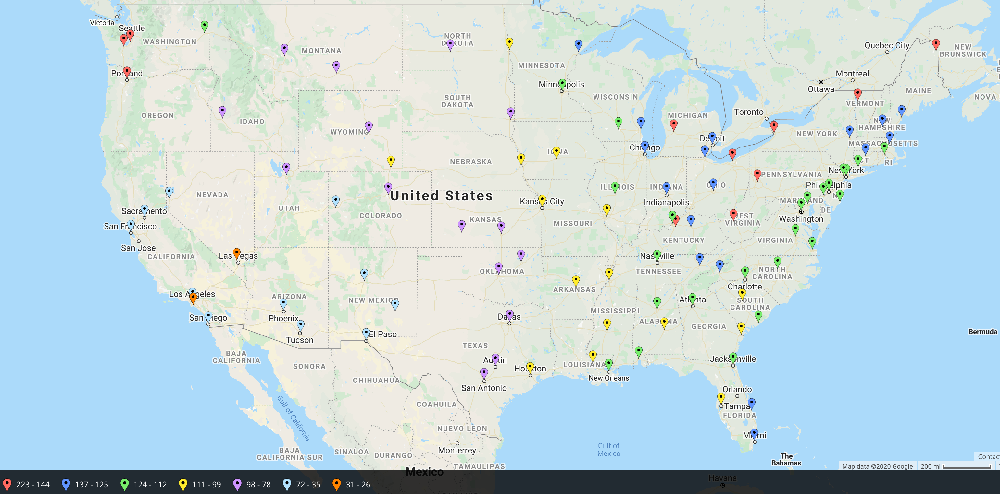
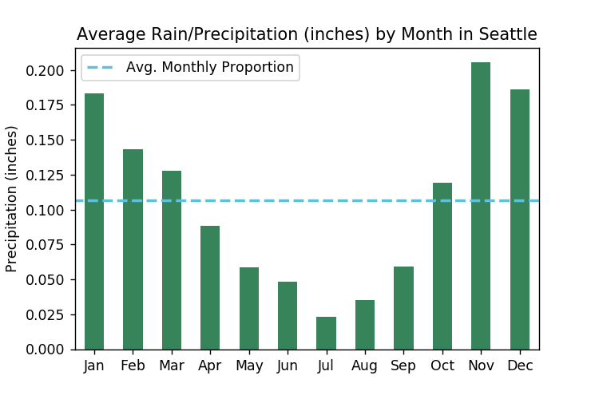
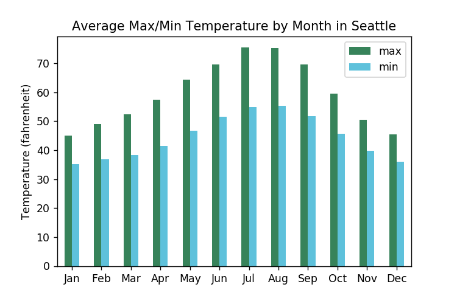
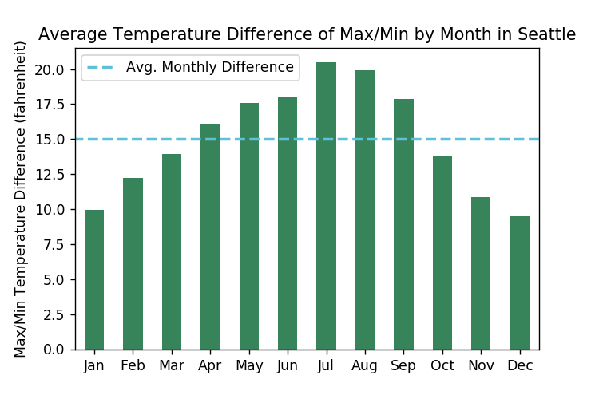
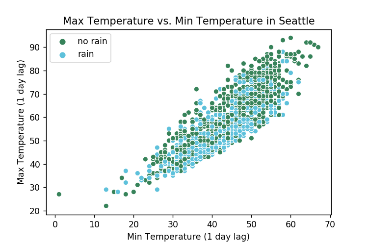
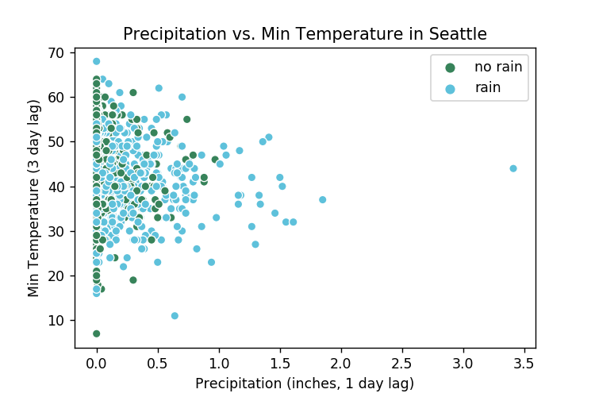
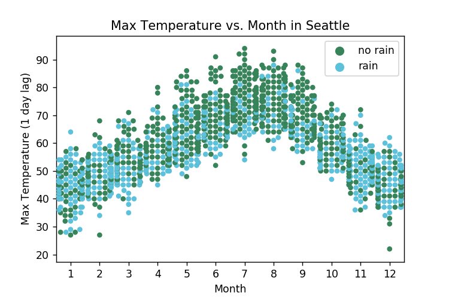
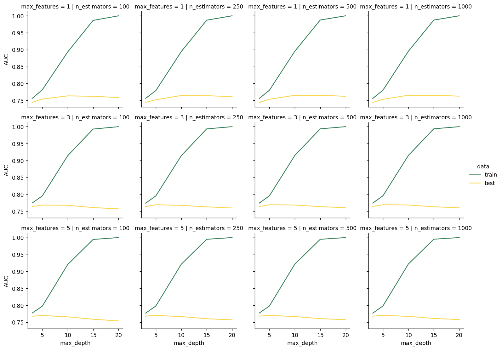
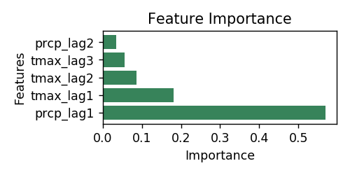

When people speak about places to live and visit, a few things come to mind almost immediately: culture, food, and __weather__. While I was looking to relocate to Seattle, my friends almost universally responded "it rains a lot there." Seattle might as well be a synonym for rain. I have lived in Chicago for  several years. The Midwest has its grey, rainy days, so I was not deterred by these comments. While I won't be comparing Chicago to Seattle in this post, I will generally explore the rain patterns of Seattle to find out if the anecdotes are true.

A few questions come to mind as it pertains to weather in Seattle:

- What frequency does it rain?
- How much rainfall occurs (measured in precipitation/inches)?
- Are there seasonal trends of rain?
- Can we predict whether it will rain on a given day with the available data?

While I won't include national data in this exploration, I will try to compare Seattle results to national averages.

The [data](https://www.kaggle.com/rtatman/did-it-rain-in-seattle-19482017) we will use is a time series from 1948-2017 with the following:

- `date`: date associated with weather metrics
- `prcp`: precipitation in inches
- `tmax`: max temperature (Fahrenheit)
- `tmin`: minimum temperature (Fahrenheit)
- `rain`: whether it rained or not

All the code used for this analysis can be found [here](https://github.com/GoldbergData/seattle-rain/blob/master/seattle_rain.ipynb).

Here are general time series plots of the numeric data. We will focus on the last few years to make it easier to notice any patterns. There is some seasonality in precipitation and temperature, which is typically common knowledge in weather and climate. However, sometimes seasonality is not obvious depending on the region.

 

## What frequency does it rain in Seattle?

It rained 43% of the time in Seattle from 1948-2017. On average, that's approximately 157 days per year.

To understand if the number of rainy days in Seattle is relatively extreme, let's compare to the rest of the U.S.

Washington is red, indicating that the state experiences rain 144-223 days over the course of the year. Our analysis shows about 153 days of rain each year from 1948-2017. There are a few other states/areas in the northeast that experience similar levels to Seattle in terms of rain. Most of the states center between 78-137 days of rain each year.

 

### Frequency by year
The previous plot is an average of the data from 1948-2017. I am curious if the proportion of rainy days significantly vary across time.

At first glance, the data looks [mean-reverting](https://mathworld.wolfram.com/ReversiontotheMean.html). There is a strong decline in rainy days starting in the mid 1970s that oscillates until the 1990s, but this is probably more random than any kind of trend.

 

### Frequency by month

Before we look at frequency of rainy days by month, what would we expect? I have spent a lot of time in Florida and we typically expect rain during the summer through the fall (hurricane season). Does Seattle follow similar trends for when rain? Probably not, given Florida is tropical and Seattle is tucked away in a mountainous region. But I am not a weather or geological expert. Let's look at the data.

Interestingly, rainy days in the summer is not the case in Seattle. On the contrary, it looks like the least amount of rainy days happen during the summer and fall! The peak amount of rainy days occur during the winter. Something to look further into would be the amount of rain/precipitation in each season. It's possible that there are not as many rainy days in the summer, but when it rains, there is more volume of rain compared to the winter.

 

## How much rainfall occurs in Seattle?

We learned that rainy days (categorized as any amount of rain occurring in a day), is least likely during the summer in Seattle. In this section, we will look further to explore the trends in actual rainfall over years and months.

We see a similar U-shape in mean precipitation compared to the rainy days plot. In other words, more actual rain fall occurs in the winter with the least amount of rainfall occurring in the summer. Let's see if temperature provides any additional information.

Higher temperatures in the summer coincide with less rain. Normally I think of higher temperatures with humidity and rain, but this is not the case in Seattle. Next we will look at temperature ranges in each month.

Seattle's winter has the most stable temperatures, while the summer has a wide gap between high/low temperatures.

 

## Are there seasonal trends of rain in Seattle?

We answered this question in our exploration. Rain is persistent in the winter, while the summer appears to experience the least amount of rain. A quick [web search](https://cliffmass.blogspot.com/2015/02/why-is-northwest-warm-and-california.html) reveals that Seattle summers are warm and dry for specific meteorological reasons that we won't get into.

 

## Can we predict Seattle Rain?

This section may be technical to some audiences. You can skip to the [conclusion](#what-did-we-learn) if you prefer.

Can we predict whether it will rain on a given day in Seattle? Through our exploration, we noticed that rainy days are related to the time of year and temperature. But our exploration did not look at lag features. We will explore some simple lag features and use them to solve the binary classification problem: rain or no rain on a given day in Seattle.

Here is a brief view of our lag features:

<table class="dataframe">
  <thead>
    <tr style="text-align: right;">
      <th></th>
      <th>date</th>
      <th>year</th>
      <th>month</th>
      <th>day</th>
      <th>rain</th>
      <th>tmin_lag1</th>
      <th>tmin_lag2</th>
      <th>tmin_lag3</th>
      <th>tmax_lag1</th>
      <th>tmax_lag2</th>
      <th>tmax_lag3</th>
      <th>prcp_lag1</th>
      <th>prcp_lag2</th>
      <th>prcp_lag3</th>
    </tr>
  </thead>
  <tbody>
    <tr>
      <th>3</th>
      <td>1948-01-04</td>
      <td>1948</td>
      <td>1</td>
      <td>4</td>
      <td>True</td>
      <td>35.0</td>
      <td>36.0</td>
      <td>42.0</td>
      <td>45.0</td>
      <td>45.0</td>
      <td>51.0</td>
      <td>0.42</td>
      <td>0.59</td>
      <td>0.47</td>
    </tr>
    <tr>
      <th>4</th>
      <td>1948-01-05</td>
      <td>1948</td>
      <td>1</td>
      <td>5</td>
      <td>True</td>
      <td>34.0</td>
      <td>35.0</td>
      <td>36.0</td>
      <td>45.0</td>
      <td>45.0</td>
      <td>45.0</td>
      <td>0.31</td>
      <td>0.42</td>
      <td>0.59</td>
    </tr>
    <tr>
      <th>5</th>
      <td>1948-01-06</td>
      <td>1948</td>
      <td>1</td>
      <td>6</td>
      <td>True</td>
      <td>32.0</td>
      <td>34.0</td>
      <td>35.0</td>
      <td>45.0</td>
      <td>45.0</td>
      <td>45.0</td>
      <td>0.17</td>
      <td>0.31</td>
      <td>0.42</td>
    </tr>
    <tr>
      <th>6</th>
      <td>1948-01-07</td>
      <td>1948</td>
      <td>1</td>
      <td>7</td>
      <td>True</td>
      <td>39.0</td>
      <td>32.0</td>
      <td>34.0</td>
      <td>48.0</td>
      <td>45.0</td>
      <td>45.0</td>
      <td>0.44</td>
      <td>0.17</td>
      <td>0.31</td>
    </tr>
    <tr>
      <th>7</th>
      <td>1948-01-08</td>
      <td>1948</td>
      <td>1</td>
      <td>8</td>
      <td>True</td>
      <td>40.0</td>
      <td>39.0</td>
      <td>32.0</td>
      <td>50.0</td>
      <td>48.0</td>
      <td>45.0</td>
      <td>0.41</td>
      <td>0.44</td>
      <td>0.17</td>
    </tr>
  </tbody>
</table>

 

### Feature exploration

Higher max temperatures on the previous day show a slight association with no rain.

Higher precipitation on the previous day seems to indicate rain.

As we discovered previously, more rain occurs during the winter seasons than the summer.

### Modeling

[Random forest](https://en.wikipedia.org/wiki/Random_forest) was used for this classification problem.

The training data included everything before the year 1990. All data 1990 and beyond was used for holdout. The data was scaled to ensure no feature dominates the training process. Lastly, since the data is a dependent time series, we used an appropriate [splitting method](https://scikit-learn.org/stable/modules/generated/sklearn.model_selection.TimeSeriesSplit.html). Note the class frequencies represent approximately what we saw in exploration:

<table class="dataframe">
  <thead>
    <tr style="text-align: right;">
      <th></th>
      <th>Weather</th>
      <th>Days Count</th>
    </tr>
  </thead>
  <tbody>
    <tr>
      <th>0</th>
      <td>No rain</td>
      <td>8808</td>
    </tr>
    <tr>
      <th>1</th>
      <td>Rain</td>
      <td>6530</td>
    </tr>
  </tbody>
</table>

There were a few missing values in this data set. These have to be removed or imputed for modeling. Since the amount of missing data is small, the data was removed.

<table border="0" class="dataframe">
  <thead>
    <tr style="text-align: right;">
      <th></th>
      <th>date</th>
      <th>prcp</th>
      <th>tmax</th>
      <th>tmin</th>
      <th>rain</th>
    </tr>
  </thead>
  <tbody>
    <tr>
      <th>18415</th>
      <td>1998-06-02</td>
      <td>NaN</td>
      <td>72</td>
      <td>52</td>
      <td>NaN</td>
    </tr>
    <tr>
      <th>18416</th>
      <td>1998-06-03</td>
      <td>NaN</td>
      <td>66</td>
      <td>51</td>
      <td>NaN</td>
    </tr>
    <tr>
      <th>21067</th>
      <td>2005-09-05</td>
      <td>NaN</td>
      <td>70</td>
      <td>52</td>
      <td>NaN</td>
    </tr>
  </tbody>
</table>

 

#### Training

Now that we have cross validation results, let's check the optimal value for parameters.

The model quickly begins to overfit with `max_depth` increasing. From sklearn documentation: 
> The maximum depth of the tree. If None, then nodes are expanded until all leaves are pure or until all leaves contain less than min_samples_split samples.

In other words, an unlimited max depth will allow the tree to grow to the extent that it fits the data perfectly. This is something we want to avoid to achieve a better [generalized](https://en.wikipedia.org/wiki/Generalization_error) result. Fitting data perfectly means we memorize all patterns — signal and noise.

We can visually inspect the cross validation plots to select optimal parameters. The results include the following best parameters for random forest based on AUC: `max_depth`: 5, `max_features`: 5, and `n_estimators`: 100.

 

#### Evaluation

The metrics below were constructed using the holdout data (year 1990 and beyond). The results are decent for a simple model using limited features. The model is correct about 72% of the time. This compares with the fact that it rains 43% of the time in Seattle. The current model is better than the naive decision to predict rain everyday (or no rain everyday).   

The model captured a decent amount of the rainy days (81% recall). The default for classifying rain or not is using the max probability. We could change the probability cutoff for classifying a rainy day if we are interested in capturing more rainy days or being more precise. We will leave that exercise for another time.

|               | precision | recall| f1-score | support|
| ------------- |:---------:| -----:|:--------:| ------:|
| rain          | 0.73      | 0.81  | 0.77     | 5834   |
| no rain       | 0.70      | 0.61  | 0.65     | 4367   |
| accuracy      |           |       | 0.72     | 10201  |
| macro avg     | 0.72      | 0.71  | 0.71     | 10201  |
| weighted avg  | 0.72      | 0.72  | 0.72     | 10201  |

 

The feature importance of the random forest reveals that the previous day's rain and temperature are the most significant factors in determining if it will rain on a given day. We could discard some of the other features that are not important to see if we can improve our generalization error, but the model result is satisfying for this exercise.

 

## What did we learn?

Generally speaking, Seattle experiences a high number of rainy days compared to the rest of the country. However, if we look at actual rainfall, [Seattle ranks](http://www.usa.com/rank/us--average-precipitation--state-rank.htm) in the middle of the pack. 

Anecdotally, Seattle's rain is known to be light and misty. Whether rain is light or heavy, it generally comes with a lack of sunshine. I took this photo on a trip in January a few years ago. The sky was consistently grey. There was rain, but it was light and hardly noticeable.

We also learned that the summers are dry and warm. Seattle summers are [rumored](https://www.thrillist.com/entertainment/seattle/17-reasons-seattle-summers-dominate-all-other-summers) to be a blast — probably driven by the mild summer weather. The winter looks predictable as the high/low temperature range is narrow. While you may see more days of rain in the winter, you can expect to wear similar layers to fend off the chilly air. Finally, to determine if it will rain tomorrow, our analysis showed that yesterday's precipitation and and temperature can help with making reasonably accurate predictions.

If you made it this far, you have learned some facts about Seattle's rain. Whether you are in a conversation or visiting sometime soon, I hope this information helps you in your high debates about Seattle weather or your travel.
