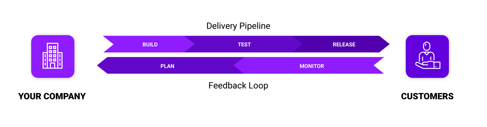
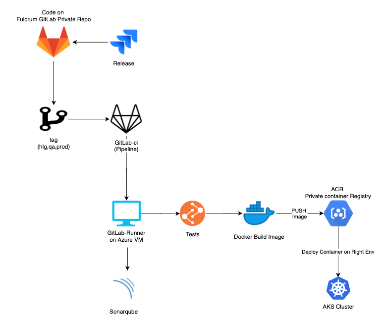
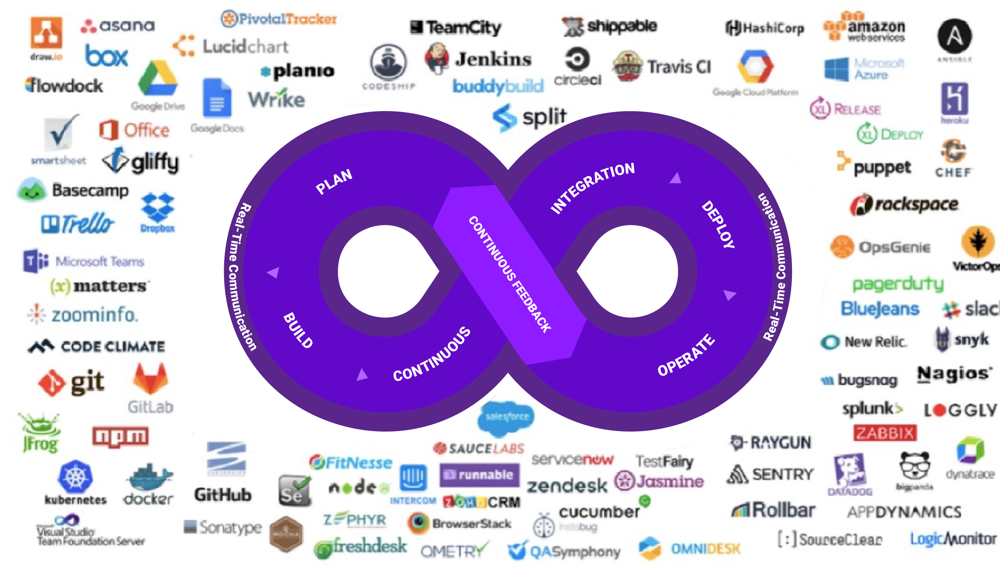
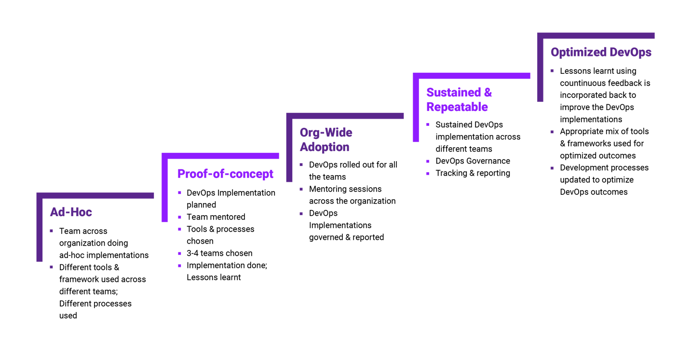

__DevOps__ is a combination of cultural philosophies, practices, and patterns, as well as tools, that improves an organization's ability to deliver applications and services at high velocity and low risk, evolving and improving products at a faster rate than organizations that use traditional software development and infrastructure engineering and operations. Organizations can better serve their customers and compete in the market because of their speed and agility.
My understanding of __DevOps__ is based on a set of adaptable services designed to help businesses build and deliver products more quickly and reliably using Azure/AWS and DevOps practices. These services make it easier to provision and manage infrastructure, deploy application code, automate software release processes, and monitor the performance of clients' applications and infrastructure.
 
`Index Terms` —Microservices architecture, serverless computing, Low-code Application, Kubernetes towards Development, DevSecOps, AI-Driven, DevOps as a Service, Machine Learning Operationalization.

 

## I.	Introduction
DEVOPS is an acronym that stands for Development and Operations. It is a software engineering practice that focuses on bringing the development and operations teams together with the goal of automating the project at every stage. This approach facilitates the easy automation of project service management to support operational objectives and improve understanding of the technological stack used in the production environment.
DevOps is also a set of cultural philosophies, practices, and tools that improve an organization's ability to deliver applications and services at high velocity: evolving and improving products at a faster rate than organizations that use traditional software development and infrastructure management processes. This speed enables businesses to provide better service to their customers and compete zmore effectively in the market.

`Figure 1. Delivery DEVOPS Model`

### A. The Aim of this Pager
Development and operations teams are no longer "silos" in a DevOps model. Pre-sales developers and testers, as well as Ops IT infrastructure, are frequently merged into a single team where the engineers work across the entire application lifecycle, from development and testing to deployment and operations, and develop a range of skills that are not limited to a single function.
Quality assurance and security teams may become more tightly integrated with development and operations in some DevOps models, as well as throughout the application lifecycle. When everyone on a DevOps team is focused on security, this is referred to as DevSecOps.
These teams employ practices to automate processes that were previously manual and time-consuming. They employ a technology stack and tooling that enables them to operate and evolve applications in a timely and dependable manner. These tools also assist engineers in independently completing tasks (for example, deploying code or provisioning infrastructure) that would normally require assistance from other teams, which increases a team's velocity even further.
Readers will learn more about Fulcrum Digital's DevOps best practices and gain knowledge on the following topics as they read this paper:

- `Security`: DevSecOps
- `Availability and Resiliency`: DevOps Maturity Model & MLops
- `Scalability`: DevOps COE (Centre of Excellence) Assessment Model
- `COE`: Performance

 

## II.	Strategy Mission
DevOps is a fundamental practice that helps organizations gain agility and speed through culture, patterns, practices, and tools. Our customers engage us to seek help primarily in one of the following activities:
-	Implement agile and align cultural practices
-	Automate configurations, infrastructure, platform, and application provisioning
-	Implement continuous integration and continuous delivery in SDLC
-	Learn and optimize engineering and operational practices 
-	Gain modularity in architecture and delivery mechanisms.
-	Reduce the cost of supporting current technology
-	Lead innovation and transformation of business 
-	Maintaining continuous delivery for multiple environments with several types of deployments in a microservice type of architectures: Increasing (Innovation, Agility, Speed, and Quality) and decreasing the cost of using the Fulcrum’s (Cultural Philosophy “Organizational mindset alignment”, Practices and Patterns “Engineering enablement” and Tools “builder empowerment”)

Fulcrum brings 20 years of industry experience, with a focus on DevOps COE. DevOps COE operated on an outcome-driven model, in which clients pay a percentage of cost savings realized by implementing our strategy. 
Fulcrum provides the execution models listed below. 
-	Remote monitoring of clients’ Development Operations (Health Check, Application, and Infrastructure Monitoring) 24 hours a day, 7 days a week
-	DevOps Practice and Go
-	DevOps As a Service
- DevOps Consulting
 

## III.	DevOps Domains of Practice

DevOps is one of the most in-demand engineering models right now. One of the reasons is that it aids in enterprise transformations. The Fulcrum DevOps transformation arose from a desire to be even more customer-focused, agile, and innovative.
A few key practices help organizations innovate faster by automating and streamlining software development and infrastructure management processes. The majority of these practices are carried out with the proper tooling.
One fundamental practice is to perform small but frequent updates. This is how businesses can innovate more quickly for their customers. These updates are typically more incremental than the occasional updates performed under traditional release practices. Frequent but minor updates reduce the risk of each deployment. They enable teams to address bugs more quickly by identifying the last deployment that caused the error. Although the frequency and size of updates will vary, organizations that use a DevOps model deploy updates much more frequently than organizations that use traditional software development practices.
A microservices architecture may also be used by organizations to make their applications more flexible and to enable faster innovation. The microservices architecture divides large, complex systems into small, self-contained projects. Applications are divided into many individual components (services), each of which is focused on a single purpose or function and operates independently of its peers and the application as a whole. This architecture reduces the coordination overhead of updating applications, and organizations can move more quickly when each service is paired with small, agile teams that take ownership of each service.
The combination of microservices and increased release frequency, on the other hand, results in significantly more deployments, which can pose operational challenges. Thus, DevOps practices such as continuous integration and continuous delivery address these issues and enable organizations to deliver quickly while remaining safe and dependable. Infrastructure automation practices such as infrastructure as code and configuration management contribute to keeping computing resources elastic and responsive to frequent changes. Furthermore, the use of monitoring and logging allows engineers to track the performance of applications and infrastructure, allowing them to respond quickly to problems.
These practices, when combined, enable organizations to provide faster and more reliable updates to their customers.

## IV.	DevOps Domains of Practice

In general, a pipeline is a collection of automated tasks/processes defined and followed by the software engineering team. DevOps pipeline is a pipeline that enables DevOps engineers and software developers to compile, build, and deploy software code to production environments in an efficient and reliable manner.
The image below depicts the Fulcrum One DevOps pipeline for deployment:

`Figure 2. F1 DevOps Pipeline`
 
## V.	DevOps Practices

The market window for products has shrunk dramatically in recent years. Almost every day, new products enter the market. This provides consumers with a plethora of options, but it comes at the expense of intense market competition. Organizations cannot afford to release major features after a prolonged period of inactivity. They tend to release small features to customers at regular intervals so that their products don't get lost in this sea of competition.

### A. DevOps COE Operating Model
Customer satisfaction is now both a company motto and the ultimate goal of any product's success. Here comes the so-called DevOps culture, which is an extremely useful tool for achieving frequent feature deployment, reduced time between bug fixes while lowering release failure rate, faster recovery time in case of erroneous deployment, and seamless product delivery. Because of these advantages, multinational corporations such as Microsoft, Amazon and Google have adopted this methodology, which has resulted in improved performance.

`Figure 3. Fulcrum Digital DevOps COE Operating Model`

DevOps traditional operating model comprises 6 phases:
##### A 1. Planning:
This is the first stage of the DevOps lifecycle, and it entails gaining a thorough understanding of the project to create the best product possible. When completed correctly, this phase provides various inputs for the development and operations phases. This phase also assists the organization in gaining clarity about the project development and management process.
This is accomplished through the use of tools such as Google Apps, Asana, Microsoft Teams, and others.
##### A 2. Development:
The planning phase is followed by the development phase, in which the project is built by creating system infrastructure, developing features by writing code, and then defining test cases and the automation process. Developers save their code in a code manager called remote repository, which facilitates team collaboration by allowing code viewing, modification, and versioning.
Tools such as git, IDEs such as eclipse and IntelliJ, and technological stacks such as Node, Java, and others are used.
##### A 3. Continuous Integration (CI):
This phase enables code validation, build, and testing to be automated. This ensures that the changes are made correctly, with no errors in the development environment, and it also allows for the identification of errors at an early stage.
Here, tools such as Jenkins, CircleCI, and others are used.
##### A 4. Deployment:
DevOps assists in the deployment automation process by utilizing tools and scripts with the ultimate goal of automating the process through feature activation. In this case, cloud services can be used as a driving force to help with the transition from finite infrastructure management to cost-optimized management with the potential for infinite resources.
Microsoft Azure, Amazon Web Services, Heroku, and other tools are used.
##### A 5. Operations:
Because of the dynamic infrastructural changes, this phase usually occurs throughout the product/lifecycle. software's This gives the team opportunities to improve the product's availability, scalability, and effective transformation.
In this phase, tools such as Loggly, BlueJeans, AppDynamics, and others are frequently used.
##### A 6. Monitoring:
Monitoring is an ongoing phase of the DevOps methodology. This phase is used to monitor and analyze data to determine the status of software applications.
Tools such as Nagios, Splunk, and others are commonly used.
The DevOps model relies on effective tooling to enable teams to deploy and innovate for their customers in a timely and dependable manner. These tools help teams manage complex environments at scale, as well as keep engineers in control of the high velocity enabled by DevOps.

`Figure 4. DevOps Tools`
 

### B. DevOps Maturity Model
DevOps Maturity is defined as a model that determines an organization's position in the vDevOps journey as well as what else needs to be done to reach the desired goals. Understanding DevOps adoption as a "constant journey, not a destination" is critical to achieving DevOps maturity.
Growth in DevOps is determined by continual learning from both team and organizational perspectives, according to the DevOps maturity model. The greater the capacities and skills, the greater the ability to tackle large-scale and complex situations.

`Figure 5. Fulcrum Digital DevOps Maturity Model`

A DevOps maturity is determined by a perfect DevOps maturity model in three ways:

-	Analyze the current state of capabilities
-	Identifying potential areas for improvement
-	Outlining the steps to achieve desired DevOps objectives

The DevOps maturity block verifies maturity in the building, deploying, and testing stages across application, data, and infrastructure levels in accordance with these three steps:

##### B 1. DevOps Maturity for Application:
The ease with which code can be moved from the Development to the Production phases determines DevOps maturity. To accomplish this, the deployment pipeline must include automated components such as builds, tests, code coverage, security scans, and monitoring.

##### B 2. DevOps Maturity by Data:
This determines DevOps maturity by the ability to clear the path for automating data changes and validating functionality on a regular basis via DataOps.

##### B 3. DevOps Maturity by Infrastructure:
DevOps maturity is determined by the ability to ease infrastructure using capabilities such as automation, streamlining, and enabling self-service to provision environments, among other things.

##### B 4. Summary:

<table class="dataframe">
  <thead>
    <tr style="text-align: right;">
      <th>Steps</th>
      <th>Step Name</th>
      <th>Definition</th>
    </tr>
  </thead>
  <tbody>
    <tr>
      <th>Step 1</th>
      <td>Initial (Ad-Hoc)</td>
      <td>Traditional environment with Dev and Ops separated is handled.
          The main tasks remain to plan and develop a fully engineered implementation roadmap by conducting a thorough assessment of the existing processes to identify areas for improvement and blindspots.
      </td>
    </tr>
    <tr>
      <th>Step 2</th>
      <td>Managed(Proof-of-Concept)</td>
      <td>The beginning of change mindset focused on agility in Dev and initial automation in Ops, with emphasis on collaboration.
          In this step, a proof of concept (PoC) is created to get a sense of the complexities involved. When the Proof of Concept is approved, the project's actual implementation work will begin.
      </td>
    </tr>
        <tr>
      <th>Step 3</th>
      <td>Defined (Org-Wide-Adoption)</td>
      <td>Organization-wide transformation begins with defined processes and established automation.
          At this stage where the project becomes ready for implementation, the actual DevOps culture can be implemented by utilizing phases such as version control, continuous integration, continuous testing, continuous deployment, continuous delivery, and continuous monitoring.
      </td>
    </tr>
        <tr>
      <th>Step 4</th>
      <td>Measured (Sustained & Repeatable) </td>
      <td>A better understanding of process and automation, followed by continuous improvement.
      </td>
    </tr>
        <tr>
      <th>Step 5</th>
      <td>Optimized(Optimized DevOps) </td>
      <td>Achievements are visible, team gaps disappear, and employees gain recognition.
      </td>
    </tr>
  </tbody>
</table>

