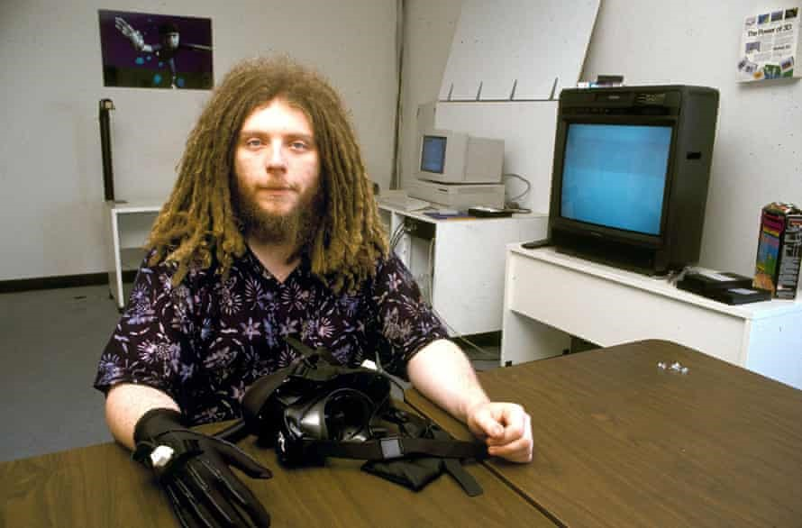
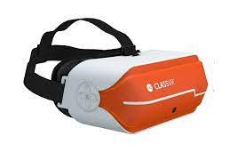
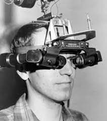
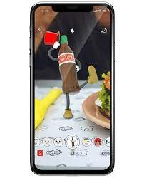

Immersive technologies, which include virtual reality, augmented reality, and mixed reality, are among the most rapidly emerging and intriguing technologies; nevertheless, what exactly is immersive technology?
To put it in a nutshell, immersive technologies create or expand reality by immersing the user in a digital environment. With applications in a variety of domains, this technology is gaining momentum and reshaping and assisting us in reimagining the future. 

## 1. History and mixed reality, virtual reality, augmented reality, and the Multiverse, Metaverse, and Megaverse:

### A. Virtual Reality
 
The historical journey of virtual reality began back in the 1800s; this marvelous idea has been evolving from the time practical photography came into existence.  

`Morton Leonard Heilig (December 22, 1926 – May 14, 1997)`
Morton Heilig invented the first VR device called sensorama in 1957. His multimedia device, the sensorama, is considered one of the earliest VR systems; however, the term virtual reality was coined later by Jaron Lanier in 1987 during his intense research on this evolving technology.
 

`Jaron Lanier (Co-founder of Virtual Reality)`

A lot of companies are investing billions of dollars in the VR sector. Some of the best via products are: Oculus Quest, Nintendo Labo VR Kit, Sony PlayStation VR, Lenovo Mirage and many more.
These gadgets let users to immerse themselves in a digital environment and experience a world that differs vastly from reality. Isn't it true that we are all about gaming? But VR's promise does not end there! It is reshaping many other industries, including education, military medicine, and sports, to name a few. For example, VR-in-real-life ClassVR is a creative new concept in the educational business that employs technology to  increase engagement and knowledge retention for students of all ages.

`ClassVR (by classvr.com)`
As effective instructional resources, ClassVR employs VR headsets with a user-friendly interface for both students and teachers, gesture controls, and a variety of additional capabilities.
Facebook is developing a new concept known as Facebook Horizon, which is an ever-expanding virtual community where users may explore, play, and create. This VR technology allows users to defy physics and reality in order to experience the impossible. 
There is also VR360 which is a 360-degree audio-visual simulation that allows the user to look around in any direction just like how they look and observe things in real life. Users can experience anything from standing on top of a pyramid to enjoying Tomorrowland sitting at home.
We can't end the topic if we didn't highlight the role of VR in gaming. A great take on this is the movie “Ready Player One” by Steven Spielberg. The film is set in the year 2045 when the world is on the brink of chaos and collapse, but humans have our salvation in a virtual reality universe where they could make the impossible possible. According to Spielberg, he said “The world that we would someday be able to escape into, we don't have to walk five feet to leave our world we just had to put something over our eyes and we are suddenly thrust into a wonderful world of someone's imagination”.

 

### B. -	Augmented Reality
 
Augmented reality is a technology that overlays computer-generated augmentations on top of reality to assist humans in performing tasks more effectively and efficiently. AR, which is a hybrid of reality and virtual reality, is a way for rendering real-world data and presenting it intuitively such that virtual elements mimic current reality to some extent.

`PokemonGo (by pokemongolive.com)`

The digital transformation does not end here; we've all heard of an app called PokémonGo that allows gamers to catch Pokémon, or of utilizing or fitting any furniture using the IKEA app; both of these are made feasible by augmented reality technology. Augmented reality has grown in popularity in recent years, and the revolution isn't going away anytime soon. AR is offering marketers the ability to engage their customers with new experiences that can be the difference between buy and dropout.
Let's take a quick look at the history of augmented reality; while it may appear to be a new technology, it has actually been around for decades.  

`Ivan Sutherland (Father of Augmented Reality)`

Ivan Sutherland developed the first air gadget called Sword of Damocles during 1968. This system used computer graphics to show users simple wireframe drawings. 
Augmented reality is beginning to enter numerous businesses in our society today, from PokémonGo to teaching future surgeons, but what exactly is augmented reality?
Looking at the most popular AR applications, the first is location-based AR apps such as Google Maps. Google Maps overlays digital directions on top of the actual environment, directing users where to walk. There's also Google Lens, which is another tool that improves the search experience. Users no longer need to type their questions with Google Lens; simply open the app and point it towards what they want to learn about; Google Lens will detect the object and return all relevant information. 
Another example is the snapchat filters which are one of the best examples of AR. 

`(Snapchat AR)`

Snapchat has undoubtedly become a trend among the younger generations.
Facebook intends to develop AR glasses that will allow users to construct 3D maps of the world, dubbed Metaverse.
 

### C. -	Mixed Reality (Metaverse)
MR is the next in this line of immersive technologies. If you've been impressed by virtual reality and augmented reality, be ready for mixed reality MR, which combines the best of both worlds.
The goal of mixed reality is to combine the real and virtual worlds. Users can engage with virtual items and mixed reality, as opposed to augmented reality. Interacting with your favorite Marvel character, which was practically impossible a few years ago and was limited to our imagination, is now possible owing to MR technology. Is it similar to augmented reality? Well, this could be called AR v2.0 
MR is still in its early stages, and it will take some time to reach consumers; nonetheless, investment in MR and AR is estimated to reach $4 billion by 2021, and the future of MR is not far away.
Numerous applications are in the works, with primary applications in education, training, sports, healthcare, space missions, and even building. The testing phase of these ideas is not at all improbable. The Microsoft HoloLens, which is simply a pair of MR smart glasses, is the best example of MR. 
MS HoloLens allows users to experience 3D holograms that melt seamlessly into the real environment. Users can interact with those augmentations using their bare hands and get all the information they need.

`Alex Kipman (HoloLens Designer- Mixed Reality)`

According to Alex Kipman, the designer behind the HoloLens, he says that “In the real world we're finding great success in mixed reality from education to healthcare, to manufacturing which is what you see a lot of the cases happening here”.

 

## 1. Toward the rise of the multiverse technology

So far, the main takeaway is that augmented reality adds digital aspects to a live setting, but virtual reality indicates a completely immersive experience that eliminates the actual world. A mixed reality experience, on the other hand, includes components of both AR and VR, allowing users to interact with both the actual world and the digital elements.

Immersive technologies are increasingly becoming a part of our daily lives, and they are here to stay, not only enhancing human experiences but also assisting brands in properly and profitably marketing their products to attract their target consumers. Immersive technologies are taking the world by storm, from gaming to furniture purchasing. The world is now thinking of reiterating on the idea first proposed by Author Neal Stephenson, who is credited with coining the term "metaverse" in his 1992 science fiction novel "Snow Crash," in which he envisioned lifelike avatars meeting in realistic 3D buildings and other virtual reality environments.
The distinction between the metaverse and the multiverse is that the metaverse is a collection of worlds, or the composite of all realities, whereas the multiverse is (philosophy) the world that lacks purpose, design, or predictability. Megaversal system, on the other hand, is a role-playing game mechanics built for Palladium Books and multiverse, or megaverse, is any possible set of numerous universes in cosmology and other sciences. The metaverse is still in its early stages; it is similar to an emerging ecosystem in that we will not fully comprehend everything that is involved in the metaverse until it reaches its final form.
So imagine you're walking down the street and you suddenly think of a product that you need, and right next to you a vending machine appears, a virtual one of course, filled with the product and all the different variations that you were thinking of, and you stop, pick up an item from the machine, it's shipped to your house, and you continue on your way, interacting in both the real world and this virtual space. 
Fortunately, the metaverse will make dangerous tasks safer by exposing people to potentially hazardous conditions from the comfort of a classroom, with the ability to repeat those courses as many times as necessary. Demonstrating the value of augmented reality training and the advantages it has over traditional methods. It will put an end to the argument about what size television to buy and whether the couch will fit through your door.
Smart IoT devices are the answer to diving into the multitude of possibilities that technology can bring to the table. Smart devices require smart portals or gates, or bridges, or gateways. To connect virtuality in its most digital form to the physical megaverse, an IoT bridge, or Internet of Things passerelle, works similarly to a typical network gateway in that it allows communication between different technologies and serves as an entry and exit point for all network data.
Merging these metaverses through the use of IoT gateways, whether through software or smart devices that sit between edge systems – such as internet-connected devices, controllers, and Nano-camera sensors – and external networks such as the cloud; this mergeability allows the translation of a variety of protocols or languages used by smart devices, such as Wi-Fi, Bluetooth, Ethernet, MQTT, or serial ports, so that components can connect back to the systems.
Keeping in mind that IoT gateways are smart, which means they receive sensor telemetry data from IoT devices, translate protocols, and process sensor data all at the network's edge before delivering it to the cloud ai-engine. All of this must be done on the edge. As the number of internet-connected gadgets and sensors increases, so does the amount of data they generate. To avoid overloading the system, IoT highways filter out ordinary or unneeded data and only pass on unexpected or vital data.
In addition to protocol translation and data filtering and processing, an IoT-based smart device should be able to perform other critical functions like device connectivity, security, updating, management, and more. Some newer bridgeability use cases show that they can operate as platforms for code that can analyze data and act, like determining that the temperature is too high, and then turning on the air conditioning. 

 

### A. -	A one-of-a-kind economy is being born.
The biggest long-term disruption is that Metaverse will be a new economy that spans both the virtual and physical worlds. The metaverse will be a persistent and synchronized live breathing cosmos that will give each of us a sense of presence and agency by allowing us to engage in a vast economy that transcends individual experiences and possibly even the physical and digital worlds.
To illustrate, the 'DecentraLand' concept is an intriguing decentralized verse that employs a local currency built on Ethereum's blockchain network. It is a virtual world video game in which the user can create his or her own avatar as a sort of participant. The technique allows for real-time interaction with other players, teamwork, and a variety of additional features.
The concept of adding a metaverse cryptocurrency is predicated on the premise that a digital world must also represent the internet itself, and being accessible via virtual reality means even merging or connecting the parallel economies that will eventually become the ultimate alternative. The vast majority of experts believe that this cryptocurrency is nothing more than so-called NFTs, or nonfungible tokens. NFTs become the key to the metaverse and people who use digital tokens will be able to become owners on the internet rather than simply renters. There is even a notion that the world we live in is still in the very early stages of the metaverse.

### B. -	Contact us
Finally, what emerging technology with respect to the metaverse does your company have in mind? What IoT devices does your company employ on a regular basis? Which components do you wish were IoT-enabled? Contact Fulcrum digital R&D labs and tell us about your plans to manufacture smart devices capable of leveraging the power of the metaverse to solve one of your long-term difficulties that requires intelligent automation.

### C. -References

1.	“5 Biggest VR Companies in the World - Insider Monkey.” Accessed November 18, 2021. https://www.insidermonkey.com/blog/5-biggest-vr-companies-in-the-world-914914/5/.
2.	“39 Ways AR Can Change The World In The Next Five Years | by Yitzi Weiner | Thrive Global | Medium.” Accessed November 18, 2021. https://medium.com/thrive-global/39-ways-ar-can-change-the-world-in-the-next-five-years-a7736f8bfaa5.
3.	GmbH, finanzen net. “Why NFTs and the Metaverse Will Make You an Owner - Not Just a Renter - on the Internet.” markets.businessinsider.com. Accessed November 18, 2021. https://markets.businessinsider.com/news/currencies/facebook-metaverse-nfts-crypto-meta-cryptocurrencies-2021-11.
4.	“Google Cardboard – Google VR.” Accessed November 18, 2021. https://arvr.google.com/cardboard/.
5.	“Space Safari.” Accessed November 18, 2021. https://orsted.com/en/explore/space-safari.
6.	“Space Safari: A Virtual Reality Space Mission | Ørsted.” Accessed November 18, 2021. https://orsted.com/en/explore/space-safari.
7.	“The Metaverse Is Coming And It’s A Very Big Deal.” Accessed November 18, 2021. https://www.forbes.com/sites/cathyhackl/2020/07/05/the-metaverse-is-coming--its-a-very-big-deal/?sh=7279ef42440f.
8.	The Verge. Snap Spectacles 3 Review: Here We Go Again, 2019. https://www.youtube.com/watch?v=exC7j6Bpef4.
9.	Vávra, P., J. Roman, P. Zonča, P. Ihnát, M. Němec, J. Kumar, N. Habib, and A. El-Gendi. “Recent Development of Augmented Reality in Surgery: A Review.” Journal of Healthcare Engineering 2017 (August 21, 2017): e4574172. https://doi.org/10.1155/2017/4574172.
10.	“Welcome to Decentraland.” Accessed November 18, 2021. https://decentraland.org/.

