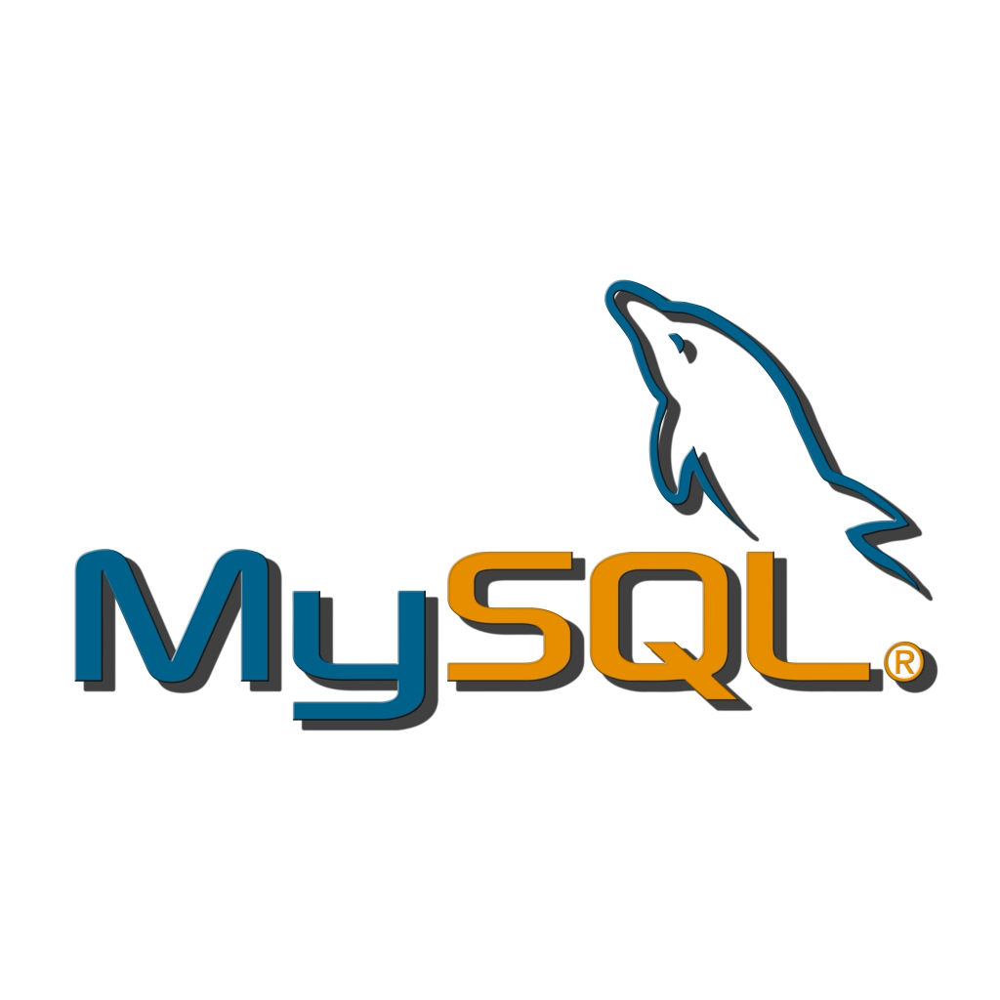

```{r setup, include=FALSE}
options(htmltools.dir.version = FALSE)
knitr::opts_chunk$set(fig.retina = 3, warning = FALSE, message = FALSE)
library(tidyverse)
library(knitr)
library(xaringan)
here::here()
```

```{r eval=FALSE, include=FALSE}
# Convert to PDF not working dimensionally
# library(webshot)
# file_name <- paste0("file://", normalizePath("slide-folder/assignment_1.html"))
# webshot(file_name, "assignment_1.pdf")

xaringan::decktape(file = "./instructor/session-3/week-3-intro-sql.html", output = "week-3-intro-sql.pdf")

# https://github.com/astefanutti/decktape
# Convert deployed slides
system("docker run --rm -t -v `pwd`:/slides astefanutti/decktape https://goldbergdata.github.io/Big-Data-Platforms/#1 assignment_1.pdf")

# Convert local slides
system("docker run --rm -t -v `pwd`:/slides -v ~:/home/user astefanutti/decktape Users/joshuagoldberg/Desktop/learncode/code/R/Projects/TA/uchicago-online-data-understanding-and-preparation/intro-R/intro-R.html slides.pdf")

# Local hosted file
system("docker run --rm -t --net=host -v `pwd`:/slides astefanutti/decktape http://localhost:8000 slides.pdf")
getwd()
```

```{r include=FALSE}
library(RMySQL)
library(keyring)
library(odbc)
library(DBI)
library(tidyverse)

# Modified since default dbplyr version does not work with MySQL
copy_nycflights13 <- function (src, ...) 
{
    all <- utils::data(package = "nycflights13")$results[, 3]
    unique_index <- list(airlines = list("carrier"), planes = list("tailnum"))
    index <- list(airports = list("faa"), flights = list(c("year", 
        "month", "day"), "carrier", "tailnum", "origin", "dest"), 
        weather = list(c("year", "month", "day"), "origin"))
    tables <- setdiff(all, dbListTables(src))
    for (table in tables) {
        df <- getExportedValue("nycflights13", table)
        message("Creating table: ", table)
        copy_to(src, df, table, unique_indexes = unique_index[[table]], 
            indexes = index[[table]], temporary = FALSE)
    }
    src
}

# ALTER USER root@localhost IDENTIFIED WITH mysql_native_password BY 'yourpassword';
# Remote access is disabled by default to MySQL, but still pick a secure password with the above SQL command
# https://stackoverflow.com/questions/14779104/how-to-allow-remote-connection-to-mysql

con_mydb <- dbConnect(
  MySQL(),
  user = key_list("r-mysql")$username,
  password = key_get("r-mysql"),
  dbname = "mydb",
  host = "localhost"
)
```

class: text-slide

# Topics

- SQL Train of Thought

- Connect/Read/Write R ↔ MySQL

- Comparing SQL and R (dplyr)

---

class: text-slide, main-slide, center, middle, hide-count

# Structured Query Language (SQL)
# Train of Thought

---

class: text-slide

SQL is a declarative language: most programming languages are imperative, but SQL focuses on declarations (i.e., I want these columns from this table, but exclude these results)
--

```{sql eval=FALSE}
SELECT origin
  ,dest
  ,air_time
FROM flights
WHERE air_time > 300
```

--

As a user of SQL, you get to focus on what you want from the language.

<div class="my-footer"><span>https://blog.jooq.org/2016/03/17/10-easy-steps-to-a-complete-understanding-of-sql/</span></div>

---

class: text-slide

SQL syntax has a few orders to consider

--

.box-1[LEXICAL]

```{sql eval=FALSE}
SELECT [DISTINCT]
FROM
WHERE
GROUP BY
HAVING
UNION
ORDER BY
```

--

.box-1[LOGICAL]

```{sql eval=FALSE}
FROM
WHERE
GROUP BY
HAVING
SELECT
DISTINCT
ORDER BY
```

<div class="my-footer"><span>https://blog.jooq.org/2016/03/17/10-easy-steps-to-a-complete-understanding-of-sql/</span></div>

---

class: text-slide

# 🚫

```{sql eval=FALSE}
SELECT dep_delay / arr_delay AS airline_metric
FROM airports
-- airline_metric is not available in this expression!
WHERE airline_metric = 10
GROUP BY tzone
```

--

# ✅

```{sql eval=FALSE}
SELECT *
FROM
  (SELECT dep_delay / arr_delay AS airline_metric
  FROM airports
  GROUP BY tzone) a
WHERE a.airline_metric = 10
```

<div class="my-footer"><span>https://blog.jooq.org/2016/03/17/10-easy-steps-to-a-complete-understanding-of-sql/</span></div>

???

Because of logical (execution) order `SELECT` comes after `WHERE` so you cannot filter on a projection that does not exist yet. Note, not all databases implement things the same way. Rule number 2, for instance, does not apply exactly in the above way to MySQL, PostgreSQL, and SQLite.

---

class: text-slide

# Tables are 👑

.pull-left[
```{sql, eval=FALSE}
SELECT *
FROM airports
  FROM flights
    FROM weather
      FROM ...
LIMIT 3;
```

```{sql echo=FALSE, eval=FALSE}
SELECT *
FROM airports
LIMIT 3;
```

```{r echo=FALSE}
nycflights13::airports %>% head(3)
```
]

--

.pull-right[...And are like variables in R

```{sql eval=FALSE}
SELECT *
  (SELECT *
    FROM airports
    WHERE tzone = 'America/New_York') new_york
```

]

<div class="my-footer"><span>https://blog.jooq.org/2016/03/17/10-easy-steps-to-a-complete-understanding-of-sql/</span></div>

???

SQL is mostly about table references, not columns. Make use of them. Don’t be afraid of writing derived tables or other complex table references.

---

class: text-slide

# `GROUP BY` modifies table references 

```{sql eval=FALSE}
SELECT year
  ,carrier 
  ,AVG(dep_delay)
FROM flights
GROUP BY year, carrier
```

- `GROUP BY` columns only are available for `SELECT` due to logical order

- ⚠️  [However, MySQL does not follow this standard](https://blog.jooq.org/2012/08/05/mysql-bad-idea-384/)


<div class="my-footer"><span>https://blog.jooq.org/2016/03/17/10-easy-steps-to-a-complete-understanding-of-sql/</span></div>

---

class: text-slide

# SQL Code Style

Can you quickly read this code easily?

```{sql eval=FALSE}
SELECT faa, flight, hour, minute, day, year, lat, lon, alt, tz, dst, tzone, dep_delay, AVG(arr_delay)
FROM flights, airports, airline, weather WHERE origin = '04G' | origin = '09J' & dest = '0S9' airline IN (SELECT carrier FROM airlines ORDER BY carrier LIMIT 1)
GROUP BY ...
```

--

- Consistency is key

--

- Follow a style [guide](https://about.gitlab.com/handbook/business-ops/data-team/platform/sql-style-guide/)

---

class: text-slide, main-slide, center, middle, hide-count

# Connect/Read/Write R ↔ MySQL

.pull-left[.center[
  <figure>
  
</figure>
]]

.pull-right[.center[
  <figure>
  
</figure>
]]

---

class: text-slide

.pull-left[
🚫 Password in scripts

```{r eval=FALSE}
# Define a connection variable used
con_mydb <- dbConnect(
  MySQL(),
  user = key_list("servicename")$username,
  # Never type your password in scripts
* password = "myVeryHardPassword123",
  dbname = "mydb",
  host = "localhost"
)
```
]

.pull-right[
✅ Use secure password retrieval

```{r eval=FALSE}
# Define a connection variable
con_mydb <- dbConnect(
  MySQL(),
  # More secure method
  user = key_list("servicename")$username,
* password = key_get("servicename"),
  # password = rstudioapi::askForPassword("Database password"),
  dbname = "mydb",
  host = "localhost"
)
```
]

- [RStudio securing credentials](https://db.rstudio.com/best-practices/managing-credentials)

- [keyring R package](https://github.com/r-lib/keyring): `install.packages("keyring")`

- `rstudioapi::askForPassword("Database password")`

---

class: text-slide

# A brief note on MySQL and Passwords

Run this command from MySQL Workbench:

```{sql eval=FALSE}
-- Assumes username is root; replace yourpassword with a password of your choosing (make it a strong password)
ALTER USER root@localhost IDENTIFIED WITH mysql_native_password BY 'yourpassword';
```

MySQL remote access is [disabled by default](https://stackoverflow.com/questions/14779104/how-to-allow-remote-connection-to-mysql), but still pick a secure password with the above SQL command to protect from any potential bad actors. Always use strong passwords.

---

class: text-slide

# R and Database Backends

- __DBI__: R Database Interface

- __dbplyr__: A 'dplyr' Back End for Databases

---

class: text-slide

.pull-left[

The __DBI__ package allows you to interface with the database in R

```{r}
# Print table names in database mydb
DBI::dbListTables(con_mydb)
```

```{r echo=FALSE}
airline_output <- nycflights13::airlines %>% 
  head(5) %>% 
  kable(format = "html")
```

```{r eval=FALSE}
dbReadTable(con_mydb, "airlines")
```

]

--

.pull-right[
Output from `dbReadTable`:

```{r echo=FALSE}
airline_output
```
]

--

```{r eval=FALSE}
DBI::dbCreateTable(con_mydb, "iris", iris)

# Set append = TRUE if table exists; you can also set overwrite = TRUE instead
DBI::dbWriteTable(con_mydb, "iris", iris, append = TRUE, row.names = FALSE)
# Drop table
DBI::dbRemoveTable(con_mydb, "iris")
# Query table
DBI::dbGetQuery(con_mydb, "SELECT * FROM iris LIMIT 10")
# Disconnect when you are finished
dbDisconnect(con_mydb)
```

```{r echo=FALSE}
airports_db <- tbl(con_mydb, "airports")
```

---

class: text-slide

.pull-left[

The __dbplyr__ package allows you to interact with the database with dplyr code

```{r eval=FALSE}
tbl(con_mydb, "airports")
```

```{r echo=FALSE, highlight.output=c(1:2)}
airports_db
```
]

.pull-right[
When working with databases, __dbplyr__ tries to be as lazy as possible (more on this later)

]

---

class: text-slide, main-slide, center, middle, hide-count

# Connecting concepts

.pull-left[

<figure>
  
</figure>

]

.pull-right[

<figure>
  
</figure>

]

---

class: text-slide

# Focusing on Data Manipulation Language (DML)

--

- `SELECT`: modify tables by selecting specific columns, changing column names, or deriving new columns

--

  - `DISTINCT`

--

  - `CASE WHEN`

--

  - `COUNT`, `MIN`, `MAX`, `SUM`, `AVG`

???

SQL Command Types
Data Definition
Language (DDL)
CREATE, ALTER, DROP,
TRUNCATE, COMMENT,
RENAME

Data Manipulation
Language (DML)
SELECT, INSERT, UPDATE,
DELETE, MERGE, CALL,
DESCRIBE, EXPLAIN,
LOCK TABLE

Data Control
Language (DCL)
GRANT, REVOKE

Transaction Control
Language (TCL)
COMMIT, SAVEPOINT,
ROLLBACK,
SET TRANSACTION

---

class: text-slide

# Focusing on Data Manipulation Language (DML)

- `WHERE`: filter tables with comparison operators

--

- `LIMIT`: control the number observations displayed after your query executes

--

- `GROUP BY`: modify table based on groups

--

  - `HAVING`: filter groups based on condition of aggregation

--

- `ORDER BY`: sort our data (ascending or descending)

---

name: memory-lane
class: hide-count
background-image: url(memory-lane.jpeg)
background-size: cover

---

class: text-slide

# Tidy data in R (Essentially third normal form)

- Each variable must have its own column

- Each observation must have its own row

- Each value must have its own cell


.center[


  

]

<div class="my-footer"><span>Image from R4DS: https://r4ds.had.co.nz/tidy-data.html</span></div>

???

Examples now of mapping R to SQL; we do not have to re-learn concepts!

---

class: text-slide

# Mapping R (dplyr) to SQL: `SELECT`, `WHERE`

Query the `nycflights13::flights` table to determine all the unique `origin`, `dest` combintions in the `year` 2013. Limit the rows to 10 observartions.

```{r}
flights_db <- tbl(con_mydb, "flights")
flights_db %>% head(2)
```

```{r echo=FALSE}
flights <- nycflights13::flights
```

---

class: text-slide

# Mapping R (dplyr) to SQL: `SELECT`, `WHERE`

```{r echo=FALSE}
res_select_where <- flights %>% 
  filter(year == 2013) %>% 
  select(origin, dest) %>% 
  distinct() %>% 
  head(5)
```

.pull-left[
.center[]
```{r}
flights_db %>% 
  filter(year == 2013) %>% 
  select(origin, dest) %>% 
  distinct() %>% 
  head(5)
```
]

.pull-right[
.center[]
```{sql eval=FALSE}
SELECT DISTINCT origin
  ,dest
FROM flights
WHERE year == 2013
LIMIT 5
```

```{r echo=FALSE}
res_select_where
```
]

---

name: confused-gif
class: hide-count
background-image: url(confused.gif)
background-size: cover

---

class: text-slide

# dbplyr translates dplyr code to SQL

.pull-left[
```{r}
flights_db %>% 
  filter(year == 2013) %>% 
  select(origin, dest) %>% 
  distinct() %>% 
  head(5) %>% 
  show_query()
```
]

--

.pull-right[
- [Verb translation](https://dbplyr.tidyverse.org/articles/translation-verb.html)

- [Expression translation](https://dbplyr.tidyverse.org/reference/translate_sql.html)

- [Function translation](https://dbplyr.tidyverse.org/articles/translation-function.html)
]

---

class: text-slide

# Mapping R (dplyr) to SQL: `MAX`, `ORDER BY`

Query the `nycflights13::flights` table to return the top five `arr_delay` by `year`, `origin`, and `dest`.

```{r echo=FALSE}
flights <- nycflights13::flights
```

---

class: text-slide

# Mapping R (dplyr) to SQL: `MAX`, `ORDER BY`

.pull-left[
.center[]
```{r eval=FALSE}
flights_db %>% 
  group_by(year, origin, dest) %>% 
  summarise(max_arr_delay = max(arr_delay)) %>% 
  arrange(desc(max_arr_delay)) %>% 
  head(5)
```
]

.pull-right[
.center[]
```{sql connection=con_mydb, output.var="res_aggr"}
SELECT year
  ,origin
  ,dest
  ,MAX(arr_delay) AS max_arr_delay
FROM flights a
GROUP BY year
  ,origin
  ,dest
ORDER BY max_arr_delay DESC
LIMIT 5
```
]

---

class: text-slide

# Mapping R (dplyr) to SQL: `MAX`, `ORDER BY`

.pull-left[
.center[]
```{r echo=FALSE}
flights_db %>% 
  group_by(year, origin, dest) %>% 
  summarise(max_arr_delay = max(arr_delay)) %>% 
  arrange(desc(max_arr_delay)) %>% 
  head(5)
```
]

.pull-right[
.center[]

```{r echo=FALSE}
res_aggr %>% as_tibble()
```
]

---

class: text-slide

# dbplyr translation: `MAX`, `ORDER BY`

.pull-left[
```{r}
flights_db %>% 
  group_by(year, origin, dest) %>% 
  summarise(max_arr_delay = max(arr_delay)) %>% 
  arrange(desc(max_arr_delay)) %>% 
  head(5) %>% 
  show_query()
```
]

---

class: text-slide

# Mapping R (dplyr) to SQL: `CASE`, `DISTINCT`

Query the `nycflights13::flights` and modify `month` to be the name of the month rather than a number. Display the distinct months with the changes.

```{r echo=FALSE}
flights <- nycflights13::flights
```

---

class: text-slide

# Mapping R (dplyr) to SQL: `CASE`, `DISTINCT`

.pull-left[
.center[]
```{r echo=FALSE}
res_dplyr <- flights_db %>% 
  distinct(month) %>% 
  mutate(month_name = case_when(
    month == 1 ~ "January",
    month == 2 ~ "February",
    month == 3 ~ "March",
    month == 4 ~ "April",
    month == 5 ~ "May",
    month == 6 ~ "June",
    TRUE ~ "Other month"
  )) %>% 
  arrange(month)
```

```{r eval=FALSE}
flights_db %>% 
  distinct(month) %>% 
  mutate(month_name = case_when(
    month == 1 ~ "January",
    month == 2 ~ "February",
    month == 3 ~ "March",
    month == 4 ~ "April",
    month == 5 ~ "May",
    month == 6 ~ "June",
    # You get the point
    TRUE ~ "Other month"
  )) %>% 
  arrange(month)
```

]

.pull-right[
.center[]
```{sql connection=con_mydb, output.var="res_case"}
SELECT DISTINCT month,
  CASE
    WHEN month = 1 THEN 'January'
    WHEN month = 2 THEN 'February'
    WHEN month = 3 THEN 'March'
    WHEN month = 4 THEN 'April'
    WHEN month = 5 THEN 'May'
    WHEN month = 6 THEN 'June'
    -- You get the point
    ELSE 'Other month'
  END month_name
FROM flights
ORDER BY month
```
]

---

class: text-slide

# Mapping R (dplyr) to SQL: `CASE`, `DISTINCT`

.pull-left[
.center[]
```{r echo=FALSE}
res_dplyr
```

]

.pull-right[
.center[]

```{r echo=FALSE}
res_case %>% as_tibble()
```
]

---

class: text-slide

# dbplyr translation: `CASE`, `DISTINCT`

.pull-left[
```{r echo=FALSE}
flights_db %>% 
  distinct(month) %>% 
  mutate(month_name = case_when(
    month == 1 ~ "January",
    month == 2 ~ "February",
    month == 3 ~ "March",
    month == 4 ~ "April",
    month == 5 ~ "May",
    month == 6 ~ "June",
    TRUE ~ "Other month"
  )) %>% 
  arrange(month) %>% 
  show_query()
```
]

```{r include=FALSE}
dbDisconnect(con_mydb)
```

---
class: text-slide

# Why use R <del>instead</del> of SQL?

Do not think of using R as a trade-off between SQL. Remember, R and SQL are both popular languages for dealing with data (data analysis, retrieval, manipulation, etc). Learning both R and SQL and how they can interface should provide a considered boost in your productivity and skills as a citizen of the data world. 

Utilize both R and SQL by their strengths. In some cases, using only R is the most effective. In other cases, you will want to use SQL. In many cases, I suspect, you will end up using _both_.

---

class: text-slide

# Why use R <del>instead</del> of SQL?

R can also help you reuse SQL code by [placing SQL code in R functions](https://glue.tidyverse.org/reference/glue_sql.html). For example, here's a query inside an R function to pull sales data and subset by region:

```{r eval=FALSE}
query_sales_data <- function(state, city, con_mydb) {
  query <- glue_sql("SELECT * FROM sales WHERE state = {state}", .con = con_mydb)
  DBI::dbGetQuery(con_mydb, query)
}
```

See this [vignette](https://dbplyr.tidyverse.org/articles/sql.html) for more examples of using dbplyr.

---

class: text-slide

# One difference between dplyr and SQL

dplyr's lexical and logical order are identical, while SQL's lexical and logical order are different (covered earlier in these slides). As a result, running R code may feel somewhat more intuitive since the steps of code execution are sequential (the same order that you write your R code).

---

class: text-slide, last-slide

# Conclusion

- Understanding lexical and logical order for SQL can help prevent common bugs in code

- R can automate SQL code generation and facilitate reusing SQL code by placing SQL code in an R functions

- You can download/upload data between R and SQL; automating the download/upload process with a programming language can save time 


