```{r setup, include=FALSE, eval=FALSE}
options(htmltools.dir.version = FALSE)
knitr::opts_chunk$set(fig.retina = 3, warning = FALSE, message = FALSE)
library(knitr)
library(xaringan)
library(RMySQL)
library(keyring)
library(odbc)
library(DBI)
library(tidyverse)
here::here()

service <- "r-mysql"

con_mydb <- dbConnect(
  MySQL(),
  user = key_list(service)$username,
  password = key_get(service),
  dbname = "mydb",
  host = "localhost"
)

con_classicmodels <- dbConnect(
  MySQL(),
  user = key_list(service)$username,
  password = key_get(service),
  dbname = "mydb",
  host = "localhost"
)
```

class: title, title-inv-7, center
count: FALSE

# Topics to discuss

--

.center[
.box-1.medium[Joins]
]

--

.center[
.box-1.medium[Sub queries]
]

--

.center[
.box-1.medium[Views]
]

---

class: text-slide, main-slide, center, middle, hide-count

# Joining data

---

class: center

```{r echo=FALSE}
knitr::include_graphics("join-venn.png")
```

<div class="my-footer"><span>https://r4ds.had.co.nz/relational-data.html</span></div>

---

class: text-slide

# Inner join

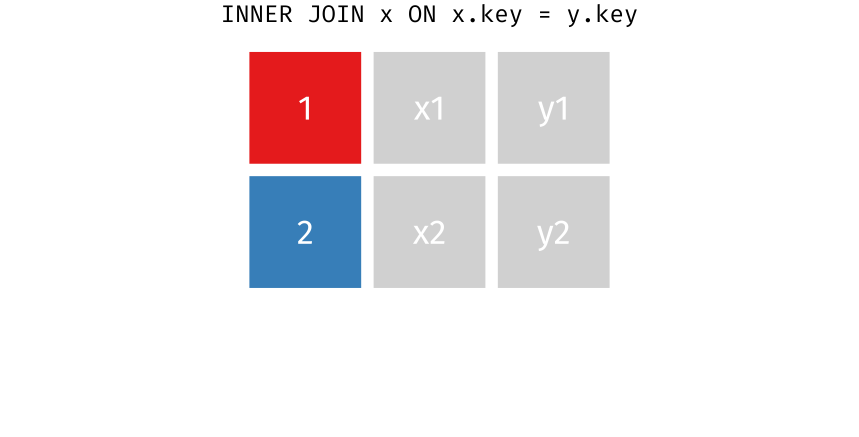

<div class="my-footer"><span>https://github.com/gadenbuie/tidyexplain</span></div>

---

class: text-slide

# Inner join

.pull-left[All rows from x where there are matching values in y, and all columns from x and y.]

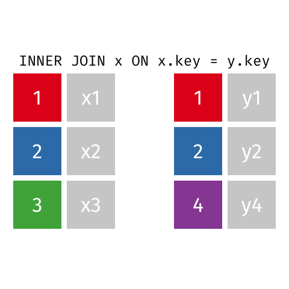

<div class="my-footer"><span>https://github.com/gadenbuie/tidyexplain</span></div>

---

class: text-slide

# Left join

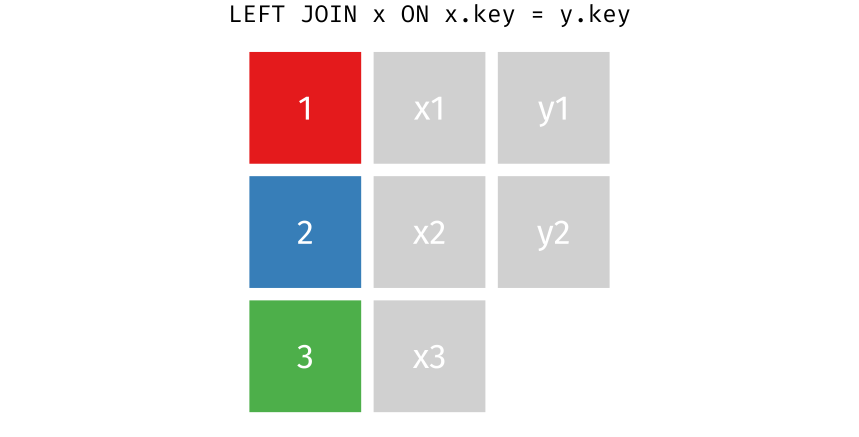

<div class="my-footer"><span>https://github.com/gadenbuie/tidyexplain</span></div>

---

class: text-slide

# Left join

.pull-left[All rows from x, and all columns from x and y. Rows in x with no match in y will have NA values in the new columns.]

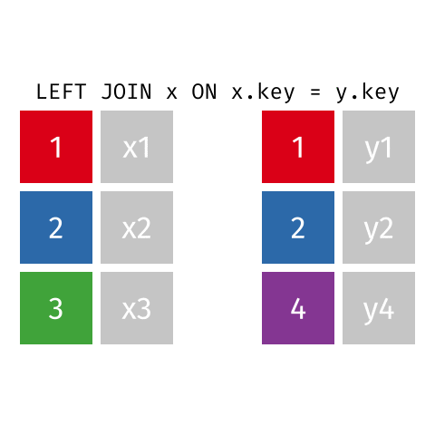

<div class="my-footer"><span>https://github.com/gadenbuie/tidyexplain</span></div>


---

class: text-slide

# Left join (extra rows in y)

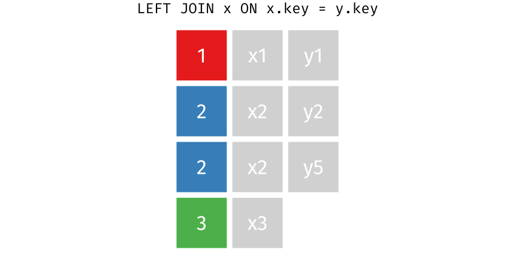

<div class="my-footer"><span>https://github.com/gadenbuie/tidyexplain</span></div>

---

class: text-slide

# Left join (extra rows in y)

.pull-left[… If there are multiple matches between x and y, all combinations of the matches are returned.]

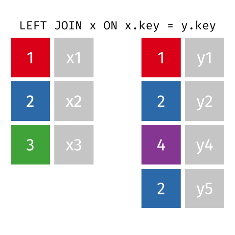

<div class="my-footer"><span>https://github.com/gadenbuie/tidyexplain</span></div>

---

class: text-slide

# Right join

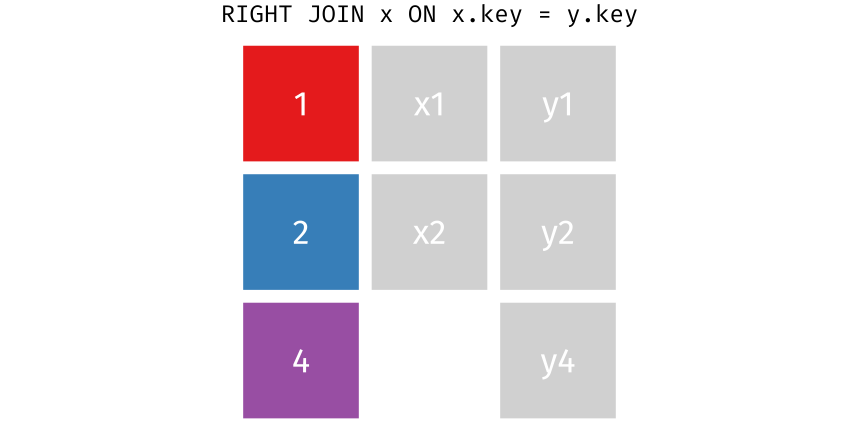

<div class="my-footer"><span>https://github.com/gadenbuie/tidyexplain</span></div>

---

class: text-slide

# Right join

.pull-left[All rows from y, and all columns from x and y. Rows in y with no match in x will have NA values in the new columns.]

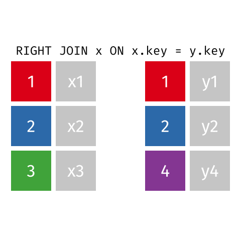

<div class="my-footer"><span>https://github.com/gadenbuie/tidyexplain</span></div>

---

class: text-slide

# Full join

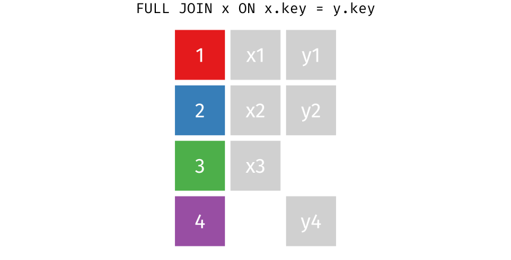

<div class="my-footer"><span>https://github.com/gadenbuie/tidyexplain</span></div>

---

class: text-slide

# Full join

.pull-left[All rows and all columns from both x and y. Where there are not matching values, returns NA for the one missing.]

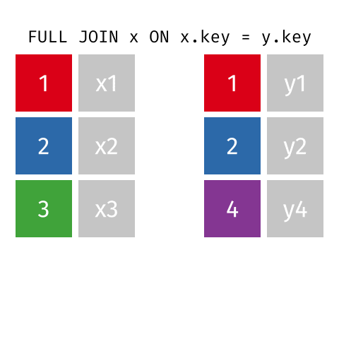

<div class="my-footer"><span>https://github.com/gadenbuie/tidyexplain</span></div>

---

class: text-slide

# Filtering join (x & y)

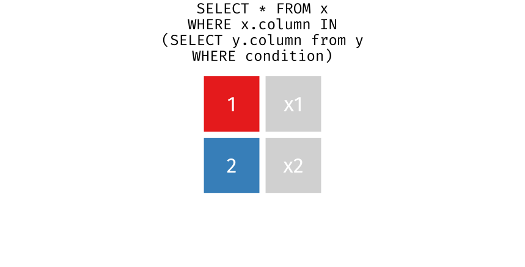

<div class="my-footer"><span>https://github.com/gadenbuie/tidyexplain</span></div>

---

class: text-slide

# Filtering join (x & y)

.pull-left[All rows from x where there are matching values in y, keeping just columns from x.]

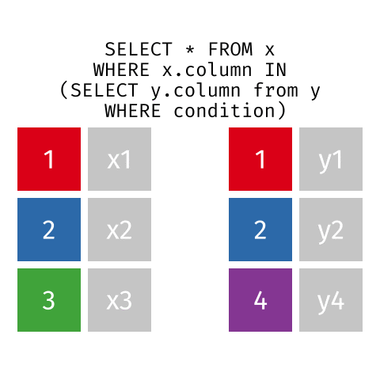

<div class="my-footer"><span>https://github.com/gadenbuie/tidyexplain</span></div>

---

class: text-slide

# Filtering join (x NOT y)

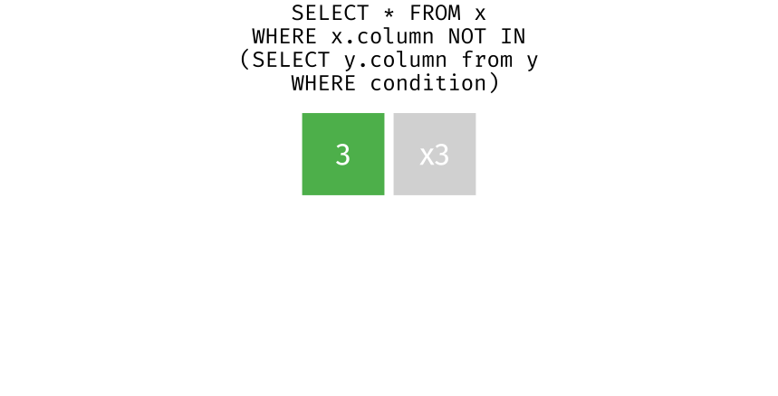

<div class="my-footer"><span>https://github.com/gadenbuie/tidyexplain</span></div>

---

class: text-slide

# Filtering join (x NOT y)

.pull-left[All rows from x where there are not matching values in y, keeping just columns from x.]

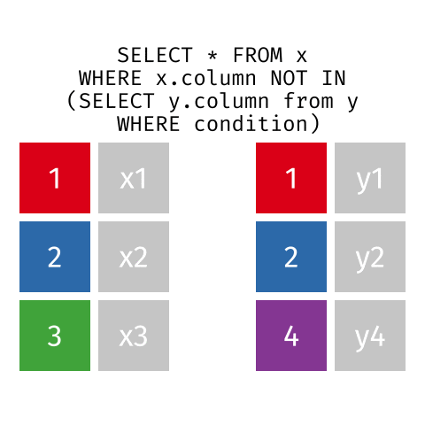

<div class="my-footer"><span>https://github.com/gadenbuie/tidyexplain</span></div>

---

class: text-slide

# Union

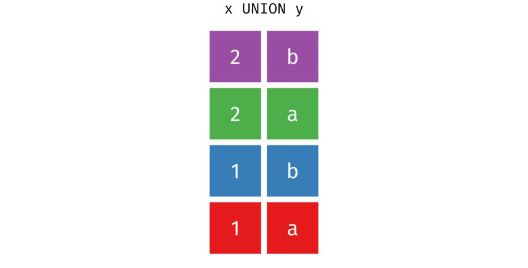

<div class="my-footer"><span>https://github.com/gadenbuie/tidyexplain</span></div>

---

class: text-slide

# Union

.pull-left[All unique rows from x and y.]


<div class="my-footer"><span>https://github.com/gadenbuie/tidyexplain</span></div>

---

class: text-slide

# Union all

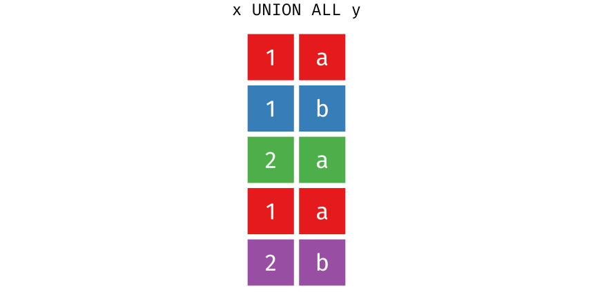

<div class="my-footer"><span>https://github.com/gadenbuie/tidyexplain</span></div>

---

class: text-slide

# Union all

.pull-left[All rows from x and y, keeping duplicates.]

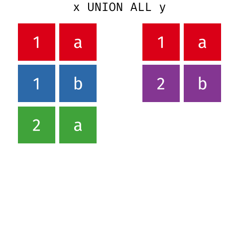

<div class="my-footer"><span>https://github.com/gadenbuie/tidyexplain</span></div>

---

class: text-slide

# R mapping to SQL (reference)

```{r echo=FALSE}
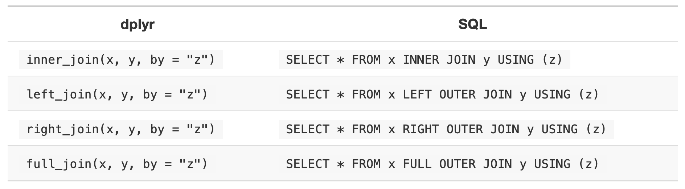
```

<div class="my-footer"><span>https://r4ds.had.co.nz/relational-data.html</span></div>

---

class: text-slide, main-slide, center, middle, hide-count

# Sub queries

---

class: text-slide

# Sub queries

.pull-left[
## Advantages

- Isolate parts of the query

- Reduce complexity of query]

.pull-right[
## Disadvantages

- Can become overly complex if too nested

- May execute slower due to optimizer]

---

class: text-slide

# Sub query examples

.pull-left[
```{sql eval=FALSE}
-- Customer who made the maximum payment
SELECT 
    customerNumber, checkNumber, amount
FROM
    payments
WHERE
    amount = (SELECT 
            MAX(amount)
        FROM
            payments);
```
]

.pull-right[
```{sql eval=FALSE}
-- Used when you wish to compute an aggregate value, 
-- but you do not want the aggregate function to apply to the main query.
SELECT 
  productName,
  buyPrice,
  (SELECT 
          MAX(buyPrice)
      FROM
          products
      WHERE
          productline = p.productline) maxBuyPriceInLine,
   (SELECT 
          AVG(buyPrice)
      FROM
          products
      WHERE
          productline = p.productline) avgBuyPriceInLine,
   (SELECT 
          MIN(buyPrice)
      FROM
          products
      WHERE
          productline = p.productline) minBuyPriceInLine                       
FROM products p;
```
]

---

class: text-slide

# Sub query (declaring variables)

Using variables to capture sub query results may be easier to read rather than nesting your sub query with other queries. Here is a [post](https://stackoverflow.com/questions/11754781/how-to-declare-a-variable-in-mysql) covering variable declaration in MySQL.

```{sql eval=FALSE}
-- Set the max amount to a variable
SET @max_amount = (SELECT MAX(amount) FROM payments);

-- Customer who made the maximum payment
SELECT 
    customerNumber, checkNumber, amount, @max_amount max_amount
FROM
    payments
WHERE
    amount = @max_amount;
```


---

class: text-slide, main-slide, center, middle, hide-count

# Views

---

class: text-slide

# Views

.pull-left[
### Advantages

.small[
- Query simplicity

- Security (narrow scope of access to views)

- Personal views

- Consistency of data despite underlying data changing]]

.pull-right[
### Disadvantages

.small[
- Performance

- Read-only]]

---

class: text-slide

# Views examples

.pull-left[
```{sql eval=FALSE}
-- View for basket values using orderdetails table
CREATE VIEW basketValue AS
    SELECT 
        orderNumber, SUM(quantityOrdered * priceEach) AS total
    FROM
        orderDetails
    GROUP BY orderNumber
    ORDER BY total DESC;
```
]

.pull-right[
```{sql eval=FALSE}
-- Create views with joins - order number, customer name, and total sales per order
CREATE VIEW customerOrders AS
    SELECT 
        d.orderNumber,
        c.customerName,
        c.phone,
        SUM(quantityOrdered * priceEach) total
    FROM
        orderDetails d
            INNER JOIN
        orders o ON o.orderNumber = d.orderNumber
            INNER JOIN
        customers c ON c.customerNumber = o.customerNumber
    GROUP BY d.orderNumber
    ORDER BY total DESC;
```
]

---

class: text-slide, main-slide, center, middle, hide-count

# Class Exercise

---

class: text-slide

# Exercise 1

- Manager would like to see the film's title , description and store_id value associated with each item and its inventory_id

- Pull a list of each film in the inventory

---

class: text-slide

# Exercise 2

- One of the investors is interested in the films we carry and how many actors are listed for each film title

- Pull a list of all titles, and figure out how many actors are associated with each title?

---

class: text-slide

# Exercise 3

- Manager from Store 1 is working on expanding the film collection there

- Pull a list of distinct titles and their descriptions, currentlt available in inventory at Store 1
