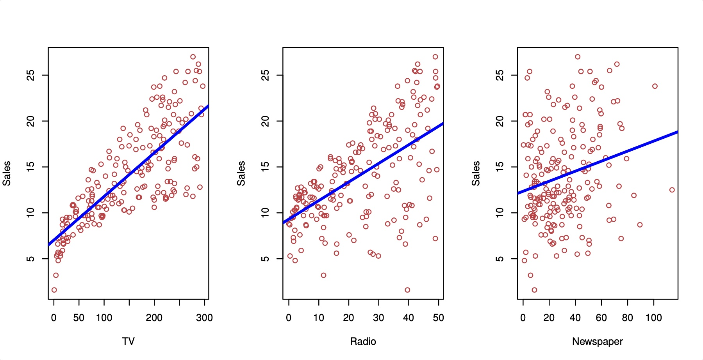
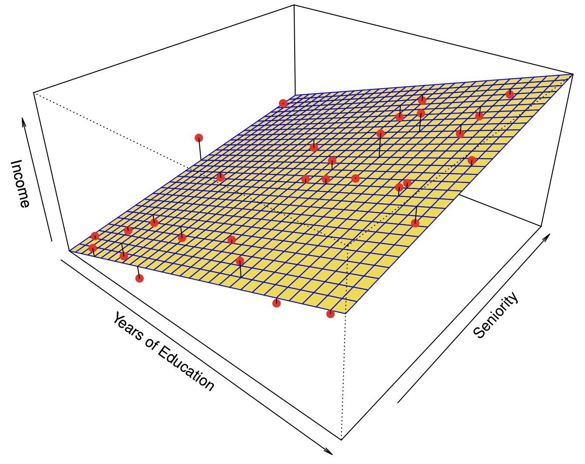
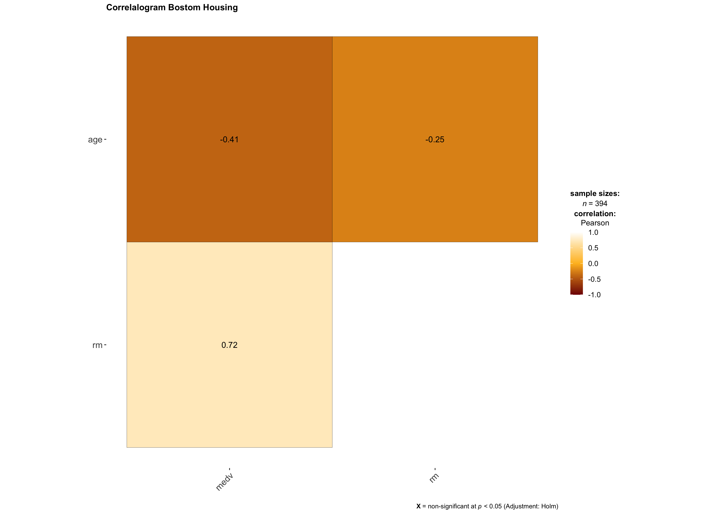
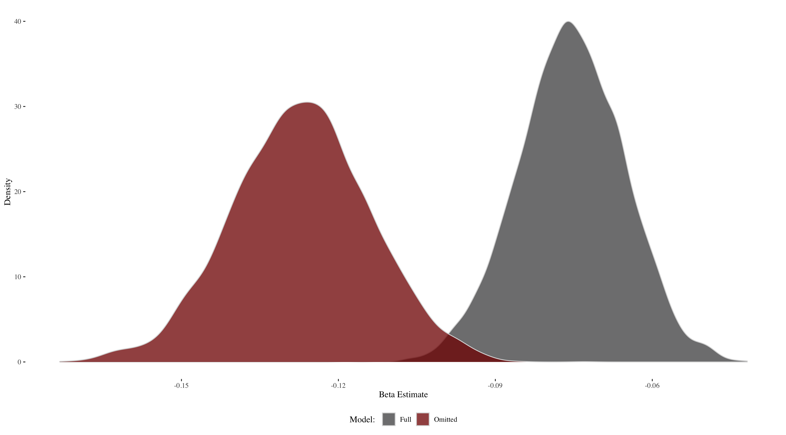

```{r setup, include=FALSE}
options(htmltools.dir.version = FALSE)
knitr::opts_chunk$set(fig.retina = 3, warning = FALSE, message = FALSE)
library(knitr)
library(xaringan)
library(tidyverse)
library(knitr)
library(dplyr)

# xaringan::decktape(file = "./slide-content/advanced-stats-session-1.html", output = "advanced-stats-session-1.pdf", docker = TRUE)
```

class: title, title-inv-7, center
count: FALSE

# Recap

--

.center[
.box-1.medium[Understanding data and different data types]
]

--

.center[
.box-1.medium[Distributions, PDF, CDF]
]

--

.center[
.box-1.medium[Sampling and descriptive statistics]
]

--

.center[
.box-1.medium[Hypothesis testing to evaluate a single parameter]
]

--

.center[
.box-1.medium[Bivariate linear model]
]

--

.center[
.box-1.medium[Correlation vs. Causation]
]

---

class: text-slide, title-inv-7, center
count: FALSE

# Agenda 

--

- .left[Multivariate linear regression]
  - .left[Model evaluation]
  - .left[Omitted variable bias]
  - .left[Multicollinearity — correlated independent variable]

--

- .left[Hypothesis testing]
  - .left[Testing multiple parameters — T test vs. F test]

--

- .left[Variable transformations — interpreting results]
  - .left[Affine]
  - .left[Polynomial]
  - .left[Logarithmic]
  - .left[Dummy variables]

---

class: text-slide, main-slide, center, middle, hide-count

# Multivariate Regression

---

class: center

# Simple Regression



<div class="my-footer"><span>https://www.statlearning.com</span></div>

---

class: center

# Multivariate Regression



<div class="my-footer"><span>https://www.statlearning.com</span></div>

---

class: text-slide

# Multivariate Regression

$y=\beta_1+\beta_1x_1+\beta_2x_2+\epsilon$
<br><br>
How do we interpret $\beta_1$, $\beta_2$?
<br>
- $y=10+3x_1+4x_2$, $x_1=5$, $x_2=3$ <br><br>
- $y=10+18+20=48$ <br><br>
- 1 unit increase in $x_1$ led to a $\beta_1$ increase in $y$ (just like bivariate regression)
- But what about $x_2$? It did not change. So this change is only true holding $x_2$ constant
- We can hold $x_2$ constant to see how $y$ changes as $x_1$ changes at that level of $x_2$

---

class: text-slide

# Evaluating the Model: Adjusted $\text{R}^2$

- Recall we can use $\text{R}^2=1-\text{SSR}/\text{TSS}$
- When we add a new independent variable, $\text{TSS}$ does not change. $\text{TSS}=(u-\text{mean}(y))^2$
- However, the new variable will always cause $\text{SSR}$, $(y-\hat{y})^2$ to decrease. Therefore, $\text{R}^2$ will always decrease, which makes adding more variables ostensibly better
- Adjusted $\text{R}^2$ adds a disincentive (penalty) for adding new variables:
$$\text{Adj R}^2=1-\frac{(n-1)}{n-k-1}\frac{\text{SSR}}{TSS}$$
<!--  Draw TSS vs. SSR -->

---

class: text-slide, table-info

# Omitted variable bias

- If we do not use multiple regression, we may get biased estimate of the variable we do include
- "The bias results in the model attributing the effect of the missing variables to the estimated effects of the included variable."
- In other words, there are two variables that determine $y$, but our model only knows about one.
- The model we estimate with one variable accounts for the full effect of $y$, when we know the effect should be split between the two variables

---


class: text-slide, table-info

# Omitted variable bias 

- When will there be no omitted variable bias effect?
  1. The second variable has no effect on $y$. Therefore, there is no extra effect to go into the first variable
  2. $x_1$ and $x_2$ are completely unrelated. Even though $x_2$ has an effect on $y$, $x_1$ lacks that information

.left.column[
$$\hat{\beta_1}=\frac{\hat{\text{Cov}}(X, Y)}{\hat{Var}(X)}$$
]

$$
\begin{split}
\hat{\text{Cov}}(\text{educ}, \text{wages}) & = \hat{\text{Cov}}(\text{educ}, \beta_1\text{educ}+\beta_2\text{exp}+\epsilon) \\
 & = \beta_1\hat{\text{Var}}(\text{educ}) + \beta_2\hat{\text{Cov}}(\text{educ}, \text{exp}) + \hat{\text{Cov}}(\text{educ}, \epsilon) \\
 & = \beta_1\hat{\text{Var}}(\text{educ}) + \beta_2\hat{\text{Cov}}(\text{educ}, \text{exp})
\end{split}
$$

$$
\text{Omitted variable bias: } \hat{\beta_1}=\beta_1+\beta_2\frac{\hat{\text{Cov}(\text{educ}, \text{exp})}}{\hat{\text{Var}}(\text{educ})}
$$

---

class: text-slide

# Calculating the bias effect

1. Population model (true relationship): $y=\beta_0+\beta_1x_1+\beta_2x_2+\nu$

2. Our model: $y=\hat{\beta}_0+\hat{\beta}_1x_1+\upsilon$

3. Auxiliary model: $x_2=\delta_0+\delta_1x_1+\epsilon$

.left-column[
- In the simple case of one regression and one omitted variable, estimating equation (2) by OLS will yield:

$$\text{E}(\hat{\beta_1})=\beta_1+\beta_2\delta$$
]

.right-column[
Equivalently, the bias is: $\text{E}(\hat{\beta_1})-\beta_1=\beta_2\delta$<br><br>

|    |      A and B are<br>positively correlated      |  A and B are<br>negatively correlated |
|----------|:-------------:|:------:|
| B is positively<br>correlated with y |  Positive bias | Negative bias |
| B is negatively<br>correlated with y |    Negative bias   |   Positive bias |
]
---

class: text-slide

# Example: Bostom Housing Data

```{r echo=FALSE}
tribble(
  ~variable, ~description,
"CRIM", "per capita crime rate by town",
"ZN", "proportion of residential land zoned for lots over 25,000 sq.ft.",
"INDUS", "proportion of non-retail business acres per town.",
"CHAS", "Charles River dummy variable (1 if tract bounds river; 0 otherwise)",
"NO", "nitric oxides concentration (parts per 10 million)",
"RM", "average number of rooms per dwelling",
"AGE", "proportion of owner-occupied units built prior to 1940",
"DIS", "weighted distances to five Boston employment centres",
"RAD", "index of accessibility to radial highways",
"TAX", "full value property tax rate per $10,000",
"PTRATIO", "pupil teacher ratio by town",
"B", "1000(Bk 0.63)^2 where Bk is the proportion of blacks by town",
"LSTAT", "% lower status of the population",
"MEDV", "Median value of owner-occupied homes in $1000's"
) %>% 
  knitr::kable(format = "html")
```

---

class: text-slide, center



---

class: text-slide, table-info

# 2,000 Regressions

- Take a random sample of 90% people out of the 506 that are in the Boston Housing data set
- Our model will be $y=\beta_1x_1+\beta_2x_2+\epsilon$, where $\beta_1=\text{age}$ and $\beta_2=\text{rm}$
- Estimate $\beta_1$ using OLS (NOT controlling for $\text{rm}$) with the sample
- Estimate $\beta_1$ using OLS, controlling for $\text{rm}$ with the same sample
- Repeat 2,000 times

.left-column[### Our data:]

```{r echo=FALSE, warning=FALSE, message=FALSE}
read_csv("HousingData.csv") %>%
  janitor::clean_names() %>% 
  head() %>% 
  knitr::kable(format = "html")
```

---

class: text-slide, center

# $\beta_1$ is underestimated when $\beta_2$ is ommitted



---

class: text-slide, main-slide, center, middle, hide-count

# Multicollinearity

---

class: text-slide

# Multicollinearity

- Multivariate linear models cannot handle perfect multicollinearity
- Example: we have two variables: $x_1$ and $x_2=3 \times x_1$
- Fit model to predict $y$ with $x_1$ and $x_2$:
  - $y=\beta_0+\beta_1x_1+\text{NA}$, where $\text{NA}$ stands for not a value <br><br>
- We can think of this as $\beta_1$ containing the entire effect for both $x_1$ and $x_2$. After all, these variables are the same.
- Including highly correlated variables in our model will not produce biased estimates, but it will harm our precision.

---

class: text-slide

# Baseball example

- Use home runs, batting average, and RBI to predict salary
- Variables are defined as follows:
  - $\text{salary}=\text{homeruns}\times 10,000+\epsilon$
  - $\text{BA}=\text{homeruns}+270+\epsilon$
  - $\text{RBI}=\text{homeruns}\times 3+\epsilon$
  - Example: $\text{homeruns}=30$, $\text{BA}=300$, $\text{RBI}=90$, $\text{salary}=300,000$
- Fit a model for each variable individually:
  - $\text{salary}=9,934.27\times\text{HR}$
  - $\text{salary}=1,002.95\times\text{BA}$
  - $\text{salary}=3,291.02\times\text{RBI}$
- Fit a model with all three: $\text{salary}=9,226.169\times \text{HR}+225.884 \times \text{RBI}+2.982 \times\text{BA}$
- What is this model saying? Why not: $\text{salary}=9,934.27\times \text{HR}+3,291.02 \times \text{RBI}+1,002.95 \times\text{BA}$

---

class: text-slide

# Helpful resource

- Omitted variable bias and multicollinearity discussion: https://are.berkeley.edu/courses/EEP118/current/handouts/OVB%20versus%20Multicollinearity_eep118_sp15.pdf


|Situation|Action|
|:----------|:-------------|
| z is correlated with both x and y | Probably best to include z but be wary of multicollinearity
| z is correlated with x but not y | Do not include z — no benefit
| z is correlated with y but not x | Include z — new explanatory power
| z is correlated with neither x nor y | Should not be much effect when including,<br>but could affect hypothesis testing — no real benefit

---

class: text-slide, main-slide, center, middle, hide-count

# Hypothesis testing

---

class: text-slide

# Hypothesis testing

.pull-left[
- The previous example demonstrates why we must use F test to test all hypothesis simultaneously rather than a T test
- Recall the T test for $H_0 \rightarrow \hat{\beta}_1=\theta\text{:} \frac{(\hat{\beta}_1-\theta)}{\text{SE}(\hat{\beta}_1)}$
- The above statistic is t-distributed under the null hypothesis, so we can see how likely it would be to get the above value from a t distribution
- If we are testing multiple hypotheses, we can apply the same logic as long as we know how that statistic is distributed. In this new test, our statistic belongs to the F distribution
]

.pull-right[
```{r echo=FALSE, fig.height=6, dpi=300}
library(ggplot2)
library(ggthemes)
x <- data.frame(x = seq(from = 0, to = 5, length = 200))
# Evaluate densities
x$df100_50 <- df(x$x, 100, 50) 
x$df50_20 <- df(x$x, 50, 20)
x$df25_10 <- df(x$x, 25, 10)
x$df5_2 <- df(x$x, 5, 2)
x$df1_1 <- df(x$x, 1, 1)

x <- gather(x, key = "y", value = "df_value", -x) %>%
  mutate(y = factor(y, levels = c(
    "df100_50", "df50_20", "df25_10", "df5_2", "df1_1"
  ))) %>% 
  filter(y %in% c("df100_50", "df50_20", "df25_10"))

ggplot(x) +
  geom_density(aes(x = x, y = df_value, fill = y), alpha = .75, color = "grey", stat = "identity") + 
  scale_fill_manual(
    name = "Degrees of Freedom",
    values = c("#4d4d4f", "#800000", "#ffbd25"),
    labels =
      c("100, 50", "50, 20", "25, 10")
  ) +
  labs(title = "F Distribution", x = NULL, y = NULL) + theme_tufte()
```
]

---

class: text-slide

# Back to baseball

- To perform an F test, we compare a model with restrictions to a model without restrictions and see if there is a significant difference. Think of restrictions as features not included in the model
- $\text{salary}=\text{years}+\text{gmsYear}+\text{HR}+\text{RBI}+\text{BA}$
- If $\text{HR}$, $\text{RBI}$, $\text{BA}$ all have no effect on $\text{salary}$, then the model $\text{salary}=\text{years}+\text{gmsYears}$ should perform just as well
- How do we measure *performance*? Sum of squared residuals (SSR)!
- Test statistics: $\frac{\text{SSR}_\text{r}-\text{SSR}_\text{ur}/q}{\text{SSR}_\text{ur}/(n-k-1)}$
- The above fraction is the ratio of two chi squared variables divided by their degrees of freedom, which makes this F-distributed
- Remember adding variables can only improve the model, so the F statistic will always be positive

---

class: text-slide, main-slide, center, middle, hide-count

# Types of variables and transformations

---

class: text-slide

# Affine

- Affine transformations are transformations that do not affect the fit of the model. The most common example is scaling transformations

- Example:
  - $\text{weight(lbs)}=5+2.4\times \text{height(inches)}$
  - $\text{weight(lbs)}=5+0.094\times \text{height(mm)}$

- This is why scaling variables is not necessary for linear regression, but knowing the scale of your variables is important for interpretation

---

class: text-slide

# Polynomial

- Linear regression can still be used to fit data with a non-linear distribution
- The model is linear in parameters, not necessarily variables
- i.e. we must have $\beta_1$, $\beta_2$, $\beta_3$, but we can utilize $x_1^2$ or $x_2/x_3$
- We might leverage the above to generate a curved regression line, providing a better fit in some cases
- How do we now interpret the coefficients?

$$\hat{\text{wage}}=3.12+.447\text{exp}-0.007\text{exp}^2$$

- The big difference is the effect of an increase in experience on wage now depends on the level of experience

---

class: text-slide

# Logarithmic

Recall that the natural logarithm is the inverse of the exponential function, so $\text{ln}(e^x)=x$, and:
<br><br>
.pull-left[
$\text{ln}(1)=0$<br><br>
$\text{ln}(0)=-\infty$<br><br>
$\text{ln}(ax)=\text{ln}(a)+\text{ln}(x)$<br><br>
]
.pull-right[
$\text{ln}(x^a)=a\text{ln}(x)$<br><br>
$\text{ln}(\frac{1}{x})=-\text{ln}(x)$<br><br>
$\text{ln}(\frac{x}{a})=\text{ln}(x) - \text{ln}(a)$<br><br>
$\frac{d\text{ln}(x)}{dx}=\frac{1}{x}$
]

---

class: text-slide

# Interpreting log variables

- $\beta_0=5$, $\beta_1=0.2$
- Level-log: $y=5+0.2\text{ln}(x)$
  - 1% change in $x=\beta_1/100$ change in $y$
<br><br>

- Log-level: $\text{ln}(y)=5+0.2(x)$
  - 1 unit change in $x=\beta_1 \times 100\text{%}$ change in $y$
<br><br>

- Log-log: $\text{ln}(y)=5+0.2\text{ln}(x)$
  - 1% change in $x=\beta_1\text{%}$ change in $y$
<br><br>

---

class: text-slide

# Dummy variables

- Dummy variables is how categorical variables can be mathematically represented
- They represent groups or place continuous variables into bins
- What is this regression telling us?
  - $\text{nbaSalary}=5\times \text{PPG}+10.5\times \text{guard}+9.6\times \text{forward}+10.8\times \text{center}$
<br><br>
- Do we need dummy variables for $guard$, $forward$, $center$?
- How would the regression change if we only used 2 out of 3?
- $\text{nbaSalary}=10.5 + 5\times \text{PPG}-0.9\times \text{forward}+0.3\times \text{center}$
