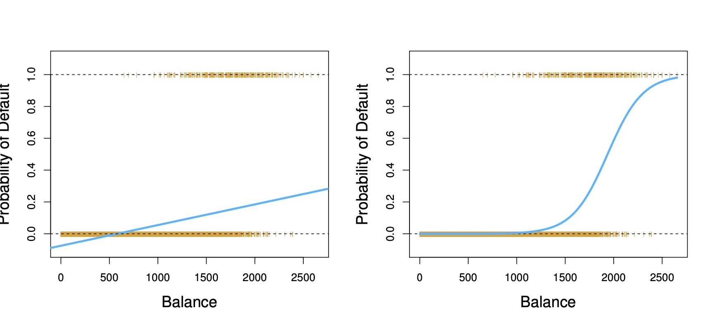

```{r setup, include=FALSE}
options(htmltools.dir.version = FALSE)
knitr::opts_chunk$set(fig.retina = 3, warning = FALSE, message = FALSE)
library(knitr)
library(xaringan)
library(tidyverse)
library(knitr)
library(dplyr)
library(recipes)
library(glue)
library(reticulate)
source("pdplot2.R")

diamonds <- ggplot2::diamonds %>% 
  sample_n(500)

# xaringan::decktape(file = "./slide-content/advanced-stats-session-1.html", output = "advanced-stats-session-1.pdf", docker = TRUE)
```

class: text-slide, title-inv-7, center, animated, slideInDown
count: FALSE

# What have we covered?

- .left[Distributions, CDF, PDF, Method of Moments]

- .left[ANOVA, Simple Regression]

- .left[Hypothesis testing, Multiple Regression]

---

class: text-slide, title-inv-7, center
count: FALSE

# Agenda

--

- .left[Logistic Regression]
  - .left[Why use Logistic Regression?]
  - .left[Forming the Logistic Regression]
  - .left[The Link Function]
  - .left[Interpreting coefficients]
  - .left[Determing the effect size]

---

class: text-slide, main-slide, center, middle, hide-count

# Why use Logistic Regression?

---

class: text-slide

# Why use Logistic Regression?

.left-column[
```{r echo=FALSE}
study_df <- read_csv("Log_Reg_Example.csv") %>% 
  mutate(id = row_number()) %>% 
  select(id, everything())

study_df_unique <- read_csv("Log_Reg_Example.csv") %>% 
  distinct() %>% 
  mutate(id = row_number()) %>% 
  select(id, everything())

study_df %>% 
  head(15) %>% 
  knitr::kable(format = "html")
```
]

.right-column[
Why don't we use Linear Regression (i.e., Linear Probability Model [LPM])?<br>
$\text{Pass test}=\beta_0+\beta_1\text{hours studied}$<br>
- Model output is unbounded: $(-\infty, \infty)$
- Constant change predicted probability for 1 unit increase in $\text{X}$
- Residual variance is not constant for different values of $\text{X}$
- Residuals can be large (outliers)
]

---

class: text-slide

# Large outliers, Non-constant variance

.pull-left[
```{r echo=FALSE}
lpm <- lm(pass ~ hours, data = study_df)
lpm %>%
  summary()
```

LPM: If we study 500 hours: `r lpm %>% predict(tibble(hours = 500)) * 100`% probability of passing.
]

.pull-right[
```{r echo=FALSE, fig.height=6}
preds_df <- tibble(pass = lpm %>% predict(study_df_unique), type = "pred") %>% 
  mutate(id = row_number()) %>% 
  select(id, everything())

study_df_unique %>% 
  mutate(type = "actual") %>% 
  bind_rows(preds_df) %>% 
  ggplot(aes(id, pass, color = type)) +
  geom_point() +
  scale_x_continuous(labels = NULL) +
  scale_y_continuous(labels = scales::percent_format(accuracy = 1)) +
  labs(x = NULL, y = "Probability of Passing a test", color = NULL) +
  scale_color_manual(
    values = c("#ffbd25", "#800000")
  ) +  
  theme_minimal() +
  theme(
    legend.position = c(.90, .55),
    legend.title = element_text(size = 14),
    legend.box.background = element_rect(colour = "black"),
    legend.title.align = 0.5,
    legend.text = element_text(size = 14)
  )    
```
]

---

class: text-slide

# Logit more interpretable 

.pull-left[
```{r echo=FALSE}
logit <- glm(pass ~ hours, data = study_df, family = "binomial")
logit %>%
  summary()
```

Logit: If we study 500 hours: `r logit %>% predict(tibble(hours = 500), type = "response") * 100`% probability of passing.
]

.pull-right[
```{r echo=FALSE, fig.height=6}
preds_df <- tibble(pass = logit %>% predict(study_df_unique,  type = "response"), type = "pred") %>% 
  mutate(id = row_number()) %>% 
  select(id, everything())

study_df_unique %>% 
  mutate(type = "actual") %>% 
  bind_rows(preds_df) %>% 
  ggplot(aes(id, pass, color = type)) +
  geom_point() +
  scale_x_continuous(labels = NULL) +
  scale_y_continuous(labels = scales::percent_format(accuracy = 1)) +
  labs(x = NULL, y = "Probability of Passing a test", color = NULL) +
  scale_color_manual(
    values = c("#ffbd25", "#800000")
  ) +  
  theme_minimal() +
  theme(
    legend.position = c(.90, .55),
    legend.title = element_text(size = 14),
    legend.box.background = element_rect(colour = "black"),
    legend.title.align = 0.5,
    legend.text = element_text(size = 14)
  )    
```
]

---

class: text-slide, center

# Why use Logistic Regression?

.center[


<div class="my-footer"><span>https://www.statlearning.com</span></div>
]

---

class: text-slide

# Reasons to use Logistic Regression

.pull-left[
- Model is bounded between $[0, 1]$
- Each incremental unit increase does not necessarily increase probability by the same weight

## Logistic formula:
- Logistic is a linear classifier
- We need a smooth function that is not discontinuous between $[0, 1]$
- We will use the standard logistic sigmoid function: $y=\frac{1}{1 + e^{-x}}$
]

```{r echo=FALSE}
sigmoid = function(x) {
   1 / (1 + exp(-x))
}

sigmoid_df <- tibble(x = seq(-5, 5, 0.01)) %>% 
  mutate(id = row_number(),
         x = sigmoid(x))

sigmoid_df %>% 
  ggplot(aes(id, x)) +
  geom_point(color = "#800000") +
  scale_x_continuous(labels = NULL) +
  labs(x = NULL) +
  theme_minimal() +
  theme(
    legend.position = c(.90, .55),
    legend.title = element_text(size = 14),
    legend.box.background = element_rect(colour = "black"),
    legend.title.align = 0.5,
    legend.text = element_text(size = 14)
  )    
```

---

class: text-slide, main-slide, center, middle, hide-count

# Forming the Logistic Regression

---

class: text-slide

# Forming the Logistic Regression

- In a linear model, both $X$ and $Y$ have a range of $(-\infty, \infty)$
- If we have a categorical dependent variable, Y now has a range of $[0, 1]$ while X still have a range of $(-\infty, \infty)$
- We must convert Y so that is has the same range as X to create a linear predictor

$$
p(Y) \in (-\infty, \infty)
$$
Convert probability to odds:

$$
\frac{p(Y)}{1-p(Y)}, \in [0, \infty)
$$
Convert odds to log odds:

$$
\text{log odds}=\text{log}(\frac{p(Y)}{1-p(Y)}), \in (-\infty, \infty)
$$

---

class: text-slide

# Forming the Logistic Regression

Linear model after conversion: $\text{log}(\frac{p(Y)}{1-p(Y)})=\beta X_i$

Calculating probability:

\begin{align}
\frac{p(Y)}{1-p(Y)} & =e^{\beta X_i} \\
 p(Y) & = (1-p(Y))e^{\beta X_i} \\
 p(Y) & = e^{\beta X_i}-p(Y)e^{\beta X_i} \\
 p(Y) + p(Y)e^{\beta X_i} & = e^{\beta X_i} \\
 p(Y)  (1+e^{\beta X_i}) & = e^{\beta X_i} \\
 p(Y) & = \frac{e^{\beta X_i}}{(1+e^{\beta X_i})}
\end{align}

---

class:text-slide

# Link Function

- Here is a our logistic regression model: $p(Y=1|X_i)=\frac{1}{1+e^{-\beta X_i}}$
- Let's compare to linear regression: $Y=\beta X_i$

- For logistic regression, our desired output y is the probability of success
- There is always a link function between predictors and output. For linear regression, it’s just the identity function. For logistic regression, we use a lopit link function
- Linear regression is linear between X and Y. Logistic regression is linear between log odds and X. 
- We use link function to transform log odds into interpretability.

---

class: text-slide

# Estimating Coefficients

- We will not use sum of squares to evaluate accuracy of this model, since this function is subject to multiple local minimums
- Instead, we’ll use logistic loss function: $$y\text{log}(p)+(1-y)\text{log}(1-p)$$
- Betas will be estimated using maximum likelihood estimation
- **Maximum likelihood:** Given a sample, what is the parameter with the highest probability of observing or what is the parameter with the maximum likelihood of being correct?

---

class: text-slide

# Interpretation of Coefficients and Output

- A 1 unit increase in X causes the log odds to increase by $\beta X_i$
- If log odds increase, odds increase, and probability increase
- If we just want to quickly classify observations, we can say any positive output from the model is a success and any negative output from the model is a failure
- Why? $$\text{log}\frac{0.5}{1-0.5}=0$$

---

class: text-slide, main-slide, center, middle, hide-count

# Partial Effects

---

class: text-slide

# An alternative link — Probit

- Inverse CDF of normal distribution of probability = $\beta_0 + \beta_1X_1$

- Link function is normal CDF


