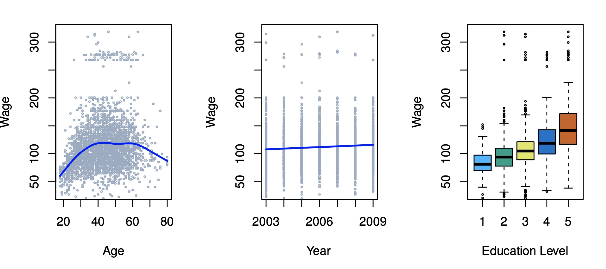

```{r setup, include=FALSE}
options(htmltools.dir.version = FALSE)
knitr::opts_chunk$set(fig.retina = 3, warning = FALSE, message = FALSE)
library(knitr)
library(xaringan)
library(tidyverse)
library(knitr)
library(dplyr)
library(recipes)
library(glue)
library(reticulate)
source("pdplot2.R")

diamonds <- ggplot2::diamonds %>% 
  sample_n(500)

# xaringan::decktape(file = "./slide-content/advanced-stats-session-1.html", output = "advanced-stats-session-1.pdf", docker = TRUE)
```

class: text-slide, title-inv-7, center, animated, slideInDown
count: FALSE

# Statistics and machine learning 

- .left[Statistics and Probability Theory are the foundations for modeling and machine learning]

- .left[Statistical Modeling will be more concerned with inference. Understanding an effect we hope to observe]

- .left[Machine Learning will be more concerned with prediction. Being able to predict an unknown value based off a sample we observed. Having a representative sample and generalizable results will be crucial]

- .left[Fit the data to desired output and *learn* from the data!]

---

class: text-slide, title-inv-7, center
count: FALSE

# Agenda

--

- .left[Comprehending data]
  - .left[Data in the grand scheme of things]
  - .left[Understanding your data frame: Rows and columns]
  - .left[Different types of data]

--

- .left[Distributions]
  - .left[Data types and distributions]
  - .left[PDF and CDF]
  - .left[Parameters and Method of Moments]
  - .left[The Normal Distribution and the Central Limit Theorem]

--

- .left[Sampling]
  - .left[How we can use sampling to achieve our goals]
  - .left[Descriptive statistics]

---

class: text-slide, main-slide, center, middle, hide-count

# Data structure and data types

---

class: text-slide

# Where does data fit in the big picture?

- Defining a problem statement
- Collecting and storing data
  - recording data, downloading data sets, web scraping or using API, data structures and lakes
- Data
- Sampling and Modeling
- .left[Insights, inference, and visualization]

---

class: text-slide

# Data types 

.center[
|Data||Description|
|:----------||:-------------|
| Binary || a value of 0/1, true/false |
| Categorical || a discrete value with limited possibilities |
| Continuous || a numerical value that has an infinite range of possibilities |
]
--

.center[


<div class="my-footer"><span>https://www.statlearning.com</span></div>
]

---

class: text-slide

# Rows and columns

.center[


<div class="my-footer"><span>https://r4ds.had.co.nz</span></div>
]

---

class: text-slide

# Rows and columns: Diamond Data Set

```{r include=FALSE}
true_false_df <-
  sample(c(TRUE, FALSE),
         size = diamonds %>% nrow,
         replace = TRUE)

diamonds <- diamonds %>% 
  mutate(id = row_number(),
         purchased = true_false_df)
```

- Two use-cases: supervised and unsupervised learning

```{r echo=FALSE}
diamonds %>% 
  head(10) %>% 
  knitr::kable(format = "html")
```

--

- **Independent variables** can be used for unsupervised modeling
- **Dependent variables** and independent variables can be used together for supervised modeling

---

class: text-slide

# Rows and columns

- Rows are linked — some rows belong to the same group
- Are the group means the same?

.center[
|city_type  |population_mil    |rainfall_inches|
|:----------|-------------:|-------------:|
| urban    | 1.2 | 38 |
| urban | .75 | 6 |
| suburban | .5 | 14 |
| suburban | .5 | 18 |
| rural | .5 | 32 |
| rural | .5 | 12|
]

- Label and categorical independent variable that can be used in a model: `city_type`
- potential dependent variables: `population_mil`, `rainfall_inches`

---

class: text-slide

# Categorical variables and dummy encoding

```{r include=FALSE}
rec <- recipe(carat ~ ., diamonds) %>% 
  step_dummy(cut, clarity, one_hot = TRUE) %>% 
  prep(training = diamonds)

diamonds_dummy_df <- bake(rec, new_data = NULL)
```

.left-column[
```{r echo=FALSE}
diamonds %>% 
  select(id, price, contains("clarity"), contains("cut")) %>% 
  head(10) %>% 
  knitr::kable(format = "html")
```
]

--

```{r echo=FALSE}
diamonds_dummy_df %>% 
  select(id, price, contains("clarity"), contains("cut")) %>% 
  head(10) %>% 
  knitr::kable(format = "html")
```

---

class: text-slide, main-slide, center, middle, hide-count

# Distributions

---

class: text-slide

# Distributions depend on the data

--

.pull-left[
- A Random Variable can follow a certain distribution, depending on the data type

- A normal distribution describes continuous, numeric data

- Bernoulli and Binomial distributions describes random variables that take binary values

- A uniform distribution can handle discrete or continuous data
]

--

```{r echo=FALSE, warning=FALSE, message=FALSE, fig.height=3, fig.align="right"}
pdplot2(
  seq(-5, 5, 0.01),
  mean = c(0, 0),
  sd = c(1, 2),
  type = "normal",
  show.color = TRUE
) +
  scale_color_manual(
    values = c("#ffbd25", "#800000")
  )
```

--

```{r echo=FALSE, warning=FALSE, message=FALSE, fig.height=3, fig.align="right"}
pdplot2(
  0:25,
  size = c(20, 30),
  prob = c(0.4, 0.5),
  type = "binomial",
  show.color = TRUE
) +
  scale_color_manual(
    values = c("#ffbd25", "#800000")
  )
```

---

class: text-slide

# Terminology of distributions

- **Moments:** Values from our sample that can help us understand our distribution

- **Parameters:** The values that define our distribution]
  - Normal: $\mu$, $\sigma$
  - Binomial: $n$, $p$
  - Uniform: $a$, $b$

- **Probability Density (Mass) Function (PDF)/(PMF):** A description of how likely certain outcomes are in a distribution

- **Cumulative Distribution Function (CDF):** A description of how much of a distribution is contained up to a certain point

---

class: text-slide

# Moments of random variables

--

- Moments describe a distribution with a set of attributes

--

- $\text{E}[X^n]$: general raw moment

--

- $\text{E}[X]$: first moment, $\mu=\frac{\sum{x}}{n}$

--

- $\text{E}[X^2]$: second raw moment (unrefined, so contains first moment information)

--

- $\text{E}[X^2]$ - $\text{E}[X]^2$: second central moment, $\sigma^2=\frac{\sum{(x-\mu})^2}{n}$

--

- For continuous data, we can mathematically represent the second central moment:

--

$$\int_{\infty}^{-\infty}f(x)x^2dx - \text{E}[X]^2$$
where $f(x)=PDF$

---

class: text-slide

# Uniform PMF/PDF, CDF

.pull-left[
```{r echo=FALSE, warning=FALSE, message=FALSE, fig.height=3}
df <- data.frame(
  x = 1:6,
  y = 1 / 6
)

df %>%
  ggplot(aes(x = x, y = y)) +
  geom_segment(aes(
    x = x,
    xend = x,
    y = 0,
    yend = y
  )) +
  geom_point(
    size = 5,
    color = "#800000",
    fill = alpha("#ffbd25", 0.3),
    alpha = 0.7,
    shape = 21,
    stroke = 2
  ) +
  scale_x_continuous(breaks = seq(0, 6, 1)) +
  scale_y_continuous(labels = scales::percent_format(accuracy = 1)) +
  labs(
    title = glue("Uniform Distribution (Discrete), a = 1, b = 6"),
    y = "Probability Mass Function",
    x = NULL
  ) +  
  theme_minimal() +
  theme(
    legend.position = c(.90, .55),
    legend.title = element_text(size = 14),
    legend.box.background = element_rect(colour = "black"),
    legend.title.align = 0.5,
    legend.text = element_text(size = 14)
  )
```

```{r echo=FALSE, warning=FALSE, message=FALSE, fig.height=3}
a <- 1; b <- 6

ggplot(data.frame(x = c(a, b)), aes(x = x)) + xlim(c(a, b)) + ylim(0, 1/(b - a)) +
  stat_function(fun = dunif, args = list(min = a, max = b), geom = "area", fill = "#800000", alpha = 0.35) + 
  stat_function(fun = dunif, args = list(min = a, max = b)) + 
  scale_x_continuous(breaks = seq(0, 6)) +
  labs(x = "\n u", y = "f(u) \n", title = "Uniform Distribution (Continuous) \n") +
  theme_minimal() +
  theme(
    legend.position = c(.90, .55),
    legend.title = element_text(size = 14),
    legend.box.background = element_rect(colour = "black"),
    legend.title.align = 0.5,
    legend.text = element_text(size = 14)
  )
```
]

.pull-right[
```{r echo=FALSE, warning=FALSE, message=FALSE, fig.height=3}
df <- data.frame(
  x = 0:6 / 6,
  type = "1, 6"
)

ggplot(df, aes(x, color = type)) +
  stat_ecdf(geom = "step") +
  geom_point(aes(y = x)) +
  scale_color_manual(values = c("#800000")) +
  labs(
    title = "Uniform Distribution (Discrete)",
    y = "Cumulative Mass Function",
    x = " ",
    color = expression(paste(italic(a), ", ", italic(b)))
  ) +
  scale_x_continuous(breaks = c(0:6 / 6), labels = scales::percent_format(accuracy = 1)) +
  scale_y_continuous(breaks = c(0:6 / 6), labels = scales::percent_format(accuracy = 1)) +
  theme_minimal() +
  theme(
    legend.position = c(.90, .55),
    legend.title = element_text(size = 14),
    legend.box.background = element_rect(colour = "black"),
    legend.title.align = 0.5,
    legend.text = element_text(size = 14)
  )  

df <- data.frame(
  x = 1:6,
  y = 1 / 6
)
```

```{r echo=FALSE, warning=FALSE, message=FALSE, fig.height=3}
uniform_df <- tibble(x = 0:6 / 6)

df <- data.frame(
  x = runif(1000, min = 1, max = 6),
  type = "1, 6"
)

ggplot(df, aes(x, color = type)) +
  stat_ecdf(geom = "step") +
  scale_color_manual(values = c("#800000")) +
  labs(
    title = "Uniform Distribution (Continuous)",
    y = "Cumulative Mass Function",
    x = " ",
    color = expression(paste(italic(a), ", ", italic(b)))
  ) +
  scale_x_continuous(breaks = seq(0, 6, 1)) +
  theme_minimal() +
  theme(
    legend.position = c(.90, .55),
    legend.title = element_text(size = 14),
    legend.box.background = element_rect(colour = "black"),
    legend.title.align = 0.5,
    legend.text = element_text(size = 14)
  )  
```
]


---

class: text-slide,centered

# Normal PDF, CDF

<iframe src="https://goldbergdata.shinyapps.io/distributions/" width=1000px, height=500px></iframe>

---

class: text-slide, main-slide, center, middle, hide-count

# Method of Moments Calculation — Normal, Uniform

---

class: text-slide

# Simulated data: Normal

.pull-left[
```{python}
import random, numpy, math
import statistics as stats, matplotlib.pyplot as plt
import seaborn as sns, pandas as pd

random.seed(50390) # reproducibility
sample_df = numpy.random.normal(
  loc=0, scale = 2, size = 1000
  ) # Normal
sample_df[0:3]
stats.mean(sample_df)
```

```{python}
# Solving for sigma using sample variance
math.sqrt(stats.variance(sample_df))
```
]

.pull-right[
```{r echo=FALSE, fig.height=7}
tibble(x = py$sample_df) %>% 
  ggplot(aes(x)) +
  geom_density(color = "#800000", position = "stack") +
  labs(
    title = "Normal Distribution (Simulated): mean: 0, sd: 2",
    y = NULL,
    x = NULL
  ) +  
  theme_minimal() +
  theme(
    legend.position = c(.90, .55),
    legend.title = element_text(size = 14),
    legend.box.background = element_rect(colour = "black"),
    legend.title.align = 0.5,
    legend.text = element_text(size = 14)
  )    
```
]

---

class: text-slide

# Mystery data: Uniform

```{python}
my_nums = pd.read_csv("my_sample.csv") #sample is uniform
my_nums = my_nums["x"].tolist()
my_nums[0:5]
```

```{python, echo=FALSE}
print(f"Data length: {len(my_nums)}")
```


```{python}
stats.mean(my_nums) #Can we use sample moments to find parameters
```

```{python}
stats.variance(my_nums)
```

---

class: text-slide

# Calculating Method of Moments: Uniform

.left-column[
$\bar{\text{X}}=5.51$
$\text{s}^2=6.67$<br>
$\text{~U}(a, b)$
]


\begin{align}
\text{E}[\mu] & =\int_{\infty}^{-\infty}\frac{1}{b-a}xdx \\
 & =  \frac{X^2}{2(b-a)} \\
 \frac{X^2}{2(b-a)} ]_a^b& = \frac{b^2}{2(b-a)}-\frac{a^2}{2(b-a)} \\
 & = \frac{b^2-a^2}{2(b-a)} \\
 \frac{b^2-a^2}{2(b-a)} & = \frac{{(b-a)}(b+a)}{2(b-a)} \\
 \text{E}[\mu] & = \frac{a+b}{2} \\
\end{align}

---

class: text-slide

# Calculating Method of Moments: Uniform

--

.left-column[
$\bar{\text{X}}=5.51$ $\text{s}^2=6.67$ <br> $\text{~U}(a, b)$ <br><br>

$\text{1) } \text{E}[\mu]=5.51=\frac{a+b}{2}$
$\text{2) } \text{V}=6.67=\frac{(b-a)^2}{12}$
]

--

.right-column[
\begin{align}
\text{Solve eq. 1 for b: } a+b & =11.02 \\
b & =11.02 - a \\
\end{align}

\begin{align}
\text{Plug b into eq. 2:  }
\frac{(11.02-a-a)^2}{12} & =6.67 \\
11.02-2a & =6.67\sqrt{12} \\
-2a& =6.67\sqrt{12}-11.02 \\
a& =\frac{6.67\sqrt{12}-11.02}{-2} \\
a& =1.04 \\
\end{align}

\begin{align}
\text{Complete eq. 1 for b: } b & =11.02 - 1.04 \\
b & =9.98 \\
\end{align}
]

---

class: text-slide

# Checking Method of Moments with the data

```{python}
print(f"a = {min(my_nums)}, max = {max(my_nums)}")
```

.center[
```{r echo=FALSE, fig.height = 5}
tibble(x = py$my_nums) %>% 
  ggplot(aes(x)) +
  geom_density(color = "#800000") +
  labs(
    title = "Uniform Distribution (Simulated): a: 1, b: 10",
    y = NULL,
    x = NULL
  ) +  
  scale_x_continuous(breaks = seq(0, 10)) +
  theme_minimal() +
  theme(
    legend.position = c(.90, .55),
    legend.title = element_text(size = 14),
    legend.box.background = element_rect(colour = "black"),
    legend.title.align = 0.5,
    legend.text = element_text(size = 14)
  )  
```
]

---

class: text-slide, main-slide, center, middle, hide-count

# Sampling and descriptive statistics

---

class: text-slide

# Choosing a representative sample

--

- Our goal when modeling is to use a sample to draw conclusions about a greater population

--

- It is important that our sample is representative of our population; Ensuring we have a sufficient sample size is helpful to accomplish this goal

--

- Sample Moments = Theoretical Moments! If the sample is not representative, this equation will mislead us

--

- Methods of repeated sampling are also good to utilize, Central Limit Theorem

---

class: text-slide

# Central Limit Theorem

```{python}
dice = [1, 2, 3, 4, 5, 6] #uniform
```

```{python}
# Central limit
# Draws from Uniform Distribution becoming normal distribution
rolls = 6
dice_means = [0] * rolls
for i in range(0,rolls):
    this_roll = random.choices(dice,k=rolls)
    dice_means[i] = stats.mean(this_roll)
```

---

class: text-slide

# Using descriptive statistics from a sample

- Measure of central tendency:
  - Mean — arithmetic average
  - Median — middle quantile (based on data sorted)
  - Mode — most common value
- Variance
- Range, IQ range
- Correlation — the foundation of linear regression
